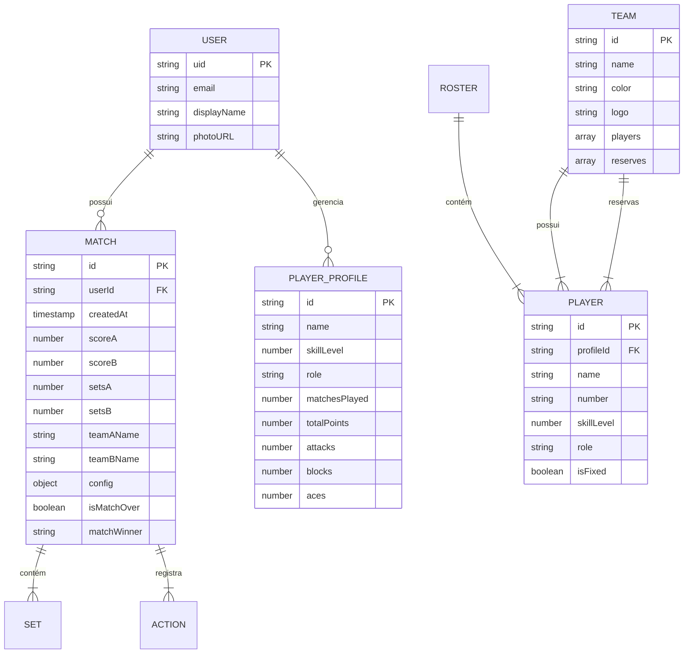

# Documentação Técnica - VolleyScore Pro v2

## 1. Visão Geral do Projeto

**VolleyScore Pro v2** é uma aplicação completa para marcação e gerenciamento de partidas de vôlei, com suporte tanto para **Indoor** quanto para **Beach Volleyball**. O aplicativo oferece placar digital interativo, estatísticas detalhadas de jogadores, comandos de voz com IA, rotação inteligente de times, sincronização em tempo real (VolleyLink Live) e exportação de relatórios em PDF.

### Tech Stack Completa

#### **Frontend**
- **React 19.0** - Biblioteca UI principal
- **TypeScript 5.3** - Tipagem estática
- **Vite 5.1** - Build tool e bundler
- **Tailwind CSS 3.4** - Framework de estilização (modo dark habilitado)
- **Framer Motion 11.0** - Animações e transições
- **Lucide React** - Biblioteca de ícones

#### **Backend e Serviços**
- **Firebase 10.8**
  - **Firestore** - Banco de dados NoSQL em tempo real (com cache persistente offline)
  - **Firebase Auth** - Autenticação de usuários (Google OAuth)
  - **Firebase Storage** - Armazenamento de arquivos (logos, avatares)
- **Google Gemini AI** (`@google/genai`) - IA para análise de partidas e comandos de voz

#### **Mobile (Híbrido)**
- **Capacitor 6.0** - Framework para compilação mobile (Android/iOS)
- **Capacitor Plugins:**
  - **AdMob** - Monetização com anúncios
  - **Speech Recognition** - Reconhecimento de voz nativo
  - **Text-to-Speech** - Narração de placar
  - **Haptics** - Feedback tátil
  - **Keep Awake** - Manter tela ativa durante partidas
  - **Screen Orientation** - Controle de orientação
  - **Share** - Compartilhamento nativo
  - **Filesystem** - Salvamento de arquivos locais
  - **Preferences** - Armazenamento persistente de configurações

#### **Gerenciamento de Estado**
- **Zustand 4.5** - State management global (para histórico e rosters)
- **Context API** - Contextos React nativos (GameContext, AuthContext, ModalContext, etc.)
- **Reducers** - Lógica complexa de jogo (gameReducer, rosterReducer)

#### **Bibliotecas Adicionais**
- **jsPDF** - Geração de relatórios PDF
- **html-to-image** - Captura de screenshots para compartilhamento
- **idb-keyval** - IndexedDB simplificado (cache offline)
- **@dnd-kit** - Drag and drop para reordenar jogadores
- **react-virtuoso** - Renderização virtualizada de listas longas

#### **Infraestrutura e Deploy**
- **Firebase Hosting** - Hospedagem Web
- **Vercel** - Deploy alternativo (configurado)
- **PWA** (Progressive Web App) - Instalável e funciona offline

#### **Testes e Quality**
- **Playwright** - Testes end-to-end automatizados

---

## 2. Estrutura do Projeto

O projeto segue uma **arquitetura baseada em features/domínios**, com separação clara entre lógica de negócio, UI e serviços.

```
VolleyScore-Pro-Versão-1.0---Official/
│
├── android/                  # Projeto Android nativo (Capacitor)
├── docs/                     # Documentação adicional e assets
├── public/                   # Assets estáticos (logos, ícones PWA)
├── src/
│   ├── App.tsx               # Componente raiz com providers e orquestração
│   ├── index.tsx             # Entry point
│   ├── index.css             # Estilos globais e Tailwind imports
│   │
│   ├── components/           # Componentes React organizados por feature
│   │   ├── Ads/              # Componentes de anúncios (AdMob)
│   │   ├── Broadcast/        # Overlays para streaming (OBS)
│   │   ├── Court/            # Quadra tática (posicionamento)
│   │   ├── Fullscreen/       # UI de tela cheia (HUD, controles)
│   │   ├── History/          # Visualização de histórico (timeline, gráficos)
│   │   ├── Settings/         # Telas de configuração
│   │   ├── Share/            # Compartilhamento de resultados
│   │   ├── Social/           # Ranking global
│   │   ├── TeamManager/      # Gerenciamento de times e jogadores
│   │   ├── modals/           # Modais (confirmações, match over, etc.)
│   │   ├── tutorial/         # Onboarding
│   │   └── ui/               # Componentes reutilizáveis (buttons, badges, etc.)
│   │
│   ├── contexts/             # React Contexts (estado global)
│   │   ├── GameContext.tsx   # Estado da partida (placar, sets, config)
│   │   ├── AuthContext.tsx   # Autenticação Firebase
│   │   ├── ModalContext.tsx  # Gerenciamento de modais
│   │   ├── NotificationContext.tsx  # Toasts e notificações
│   │   ├── TimerContext.tsx  # Cronômetro de partida
│   │   └── LanguageContext.tsx  # Internacionalização (i18n)
│   │
│   ├── reducers/             # Lógica de estado complexa
│   │   ├── gameReducer.ts    # Redução de ações do jogo (pontos, timeouts, etc.)
│   │   ├── rosterReducer.ts  # Gerenciamento de elencos e rotação
│   │   └── ...
│   │
│   ├── services/             # Camada de serviços (I/O, integrações)
│   │   ├── firebase.ts       # Inicialização Firebase (Auth, Firestore, Storage)
│   │   ├── AnalysisEngine.ts # Análise de momentum e estatísticas
│   │   ├── GeminiCommandService.ts  # IA Gemini para comandos de voz
│   │   ├── VoiceRecognitionService.ts  # Speech-to-text nativo
│   │   ├── TTSService.ts     # Text-to-speech (narração de placar)
│   │   ├── SyncEngine.ts     # Sincronização real-time (VolleyLink Live)
│   │   ├── PDFService.ts     # Geração de relatórios
│   │   ├── ImageService.ts   # Captura de screenshots
│   │   ├── AdService.ts      # AdMob (banner, interstitial, rewarded)
│   │   ├── AudioService.ts   # Sons de efeito (tap, undo, set-win)
│   │   ├── PlatformService.ts  # Detecção de plataforma (web/native)
│   │   └── io.ts             # Backup/restore local (IndexedDB + Filesystem)
│   │
│   ├── hooks/                # Custom React Hooks
│   │   ├── useVoiceControl.ts  # Controle por voz
│   │   ├── useGameAudio.ts   # Reprodução de sons
│   │   ├── useHaptics.ts     # Feedback tátil
│   │   ├── useKeepAwake.ts   # Manter tela ativa
│   │   ├── useScoreAnnouncer.ts  # TTS automático
│   │   ├── usePlatform.ts    # Detecção web/mobile
│   │   └── ...
│   │
│   ├── stores/               # Zustand stores
│   │   ├── historyStore.ts   # Histórico de partidas
│   │   └── rosterStore.ts    # Templates de times salvos
│   │
│   ├── types/                # Definições TypeScript
│   │   ├── domain.ts         # Tipos de domínio (GameState, Player, Team, etc.)
│   │   ├── services.ts       # Tipos de serviços (SyncRole, etc.)
│   │   └── ui.ts             # Tipos de UI
│   │
│   ├── utils/                # Funções utilitárias
│   │   └── animations.ts, formatters.ts, validators.ts, etc.
│   │
│   └── constants.ts          # Feature flags e constantes globais
│
├── firestore.rules           # Regras de segurança Firestore
├── firestore.indexes.json    # Índices compostos Firestore
├── storage.rules             # Regras de segurança Storage
├── firebase.json             # Configuração Firebase Hosting
├── capacitor.config.ts       # Configuração Capacitor (mobile)
├── vite.config.ts            # Configuração Vite (build, PWA)
├── tailwind.config.js        # Configuração Tailwind CSS
├── tsconfig.json             # Configuração TypeScript
└── package.json              # Dependências e scripts
```

### Padrões Arquiteturais

1. **Context + Reducers**: Estado complexo gerenciado por reducers puros, exposto via Context API.
2. **Feature-Based Organization**: Componentes agrupados por funcionalidade, não por tipo.
3. **Service Layer**: Toda I/O (Firebase, IA, Storage) isolada em serviços testáveis.
4. **Custom Hooks**: Lógica reutilizável encapsulada em hooks (ex: `useVoiceControl`, `useGameAudio`).
5. **Atomic Design (parcial)**: Componentes UI genéricos em `components/ui/`.

---

## 3. Banco de Dados e Modelagem

### Firestore Collections

O app usa **Firestore** como banco de dados principal, com as seguintes collections:

```
/users/{userId}
  ├── /matches/{matchId}               # Histórico de partidas do usuário
  │   ├── /sets/{setId}                 # Sets da partida
  │   └── /actions/{actionId}           # Ações (pontos, timeouts)
  └── /profiles/{profileId}             # Perfis de jogadores cadastrados

/rosters/{rosterId}                     # Times salvos (templates)
  └── /players/{playerId}               # Jogadores do roster

/public/{document}                      # Dados públicos (rankings globais)

/live_matches/{sessionId}               # Sessões de transmissão ao vivo (VolleyLink Live)
```

### Diagrama de Relacionamentos (Mermaid)



### Principais Entidades

#### **GameState** (Estado Principal do Jogo)
- `teamAName`, `teamBName`: Nomes dos times
- `scoreA`, `scoreB`: Placar do set atual
- `setsA`, `setsB`: Sets vencidos
- `currentSet`: Número do set atual
- `servingTeam`: Time que está sacando ('A' | 'B')
- `config`: Configurações da partida (GameConfig)
- `teamARoster`, `teamBRoster`: Elencos em quadra
- `queue`: Fila de times para rotação (modo Balanced)
- `actionLog[]`: Histórico de ações (para undo)
- `matchLog[]`: Log persistente da partida
- `syncRole`: 'none' | 'host' | 'spectator' (VolleyLink Live)

#### **GameConfig** (Configurações)
- `mode`: 'indoor' | 'beach'
- `maxSets`: 1 | 3 | 5
- `pointsPerSet`: 15 | 21 | 25
- `hasTieBreak`: boolean
- `deuceType`: 'standard' | 'sudden_death_3pt'
- `rotationMode`: 'standard' | 'balanced'
- `voiceControlEnabled`: boolean
- `enablePlayerStats`: boolean (Scout Mode)
- `announceScore`: boolean (TTS automático)
- `adsRemoved`: boolean (Premium)
- `developerMode`: boolean

#### **Player** (Jogador)
- `id`: string (UUID)
- `profileId?`: string (link para ProfileStats)
- `name`: string
- `number?`: string (camisa)
- `skillLevel`: number (1-10)
- `role`: 'setter' | 'hitter' | 'middle' | 'libero' | 'none'
- `isFixed`: boolean (fixado na rotação Balanced)

#### **Team** (Time)
- `id`: string
- `name`: string
- `color`: string (hex ou Tailwind color)
- `logo?`: string (URL Firebase Storage)
- `players[]`: Jogadores em quadra
- `reserves[]`: Banco de reservas

---

## 4. Principais Funcionalidades e Fluxos

### 4.1. Autenticação

**Provedor**: Firebase Auth com Google OAuth

**Fluxo**:
1. Usuário clica em "Login com Google" (componente `AuthModal`)
2. `AuthContext` chama `signInWithPopup(auth, googleProvider)`
3. Firebase retorna `user.uid` e `user.displayName`
4. Context armazena estado do usuário
5. Firestore cria/atualiza documento `/users/{uid}`

**Importante**: Autenticação é **opcional** para uso básico. Funcionalidades que exigem login:
- Salvar histórico de partidas na nuvem
- VolleyLink Live (transmissão)
- Ranking global
- Sincronização entre dispositivos

### 4.2. Fluxo Principal: Marcar Ponto

```
1. [UI] Usuário toca no botão "+" do Team A (ScoreCardNormal)
2. [Component] Dispara handleAddPointGeneric('A', playerId?, skill?)
3. [Context] GameContext.addPoint() chama dispatch({ type: 'POINT', team: 'A', metadata })
4. [Reducer] gameReducer.ts:
   - Incrementa scoreA
   - Verifica se set acabou (scoreA >= 25 && diff >= 2)
   - Se sim: incrementa setsA, reseta placar, vai pro próximo set
   - Verifica se match acabou (setsA >= config.maxSets / 2 + 1)
   - Atualiza servingTeam (se aplicável)
   - Registra ação em actionLog[] (para undo)
   - Atualiza estatísticas do jogador (se profileId existe)
5. [Side Effects]
   - useGameAudio() reproduz som "tap"
   - useHaptics() vibra dispositivo (se mobile)
   - useScoreAnnouncer() narra placar (se TTS ativo)
   - SyncEngine.broadcastState() envia para espectadores (se VolleyLink Live)
6. [UI] React re-renderiza com novo estado
```

### 4.3. Rotação Inteligente de Times (Modo Balanced)

**Propósito**: Em jogos recreativos com muitos jogadores, o app rotaciona automaticamente times equilibrados.

**Algoritmo** (`rosterReducer.ts`):
1. A cada X pontos (configurável), dispara `ROTATE_TEAMS`
2. Time A (atual) sai para a fila (`queue[]`)
3. Time B permanece em quadra (advantage do vencedor)
4. Primeiro time da fila entra como novo Time A
5. **Rebalanceamento**: Jogadores com `isFixed: false` são redistribuídos entre os times usando algoritmo de balanceamento por `skillLevel`
6. Registra `RotationReport` (quem saiu, quem entrou, quem foi "roubado")

### 4.4. Comandos de Voz com IA (Gemini)

**Fluxo**:
1. Usuário pressiona microfone (FloatingControlBar)
2. `VoiceRecognitionService` escuta fala (Capacitor Speech Recognition)
3. Transcrição enviada para `GeminiCommandService`
4. Gemini AI interpreta intent:
   - "Ponto para o Time A" → `{ type: 'point', team: 'A', confidence: 0.95 }`
   - "João fez um ace" → `{ type: 'point', team: 'A', player: { name: 'João' }, skill: 'ace' }`
   - "Desfazer" → `{ type: 'undo' }`
5. `useVoiceControl` hook executa ação correspondente
6. Notificação visual confirma ação

**Contexto enviado para IA**:
- Nomes dos times
- Lista de jogadores (para reconhecer nomes)
- Time que está sacando
- Idioma do usuário

### 4.5. VolleyLink Live (Sincronização Real-Time)

**Arquitetura**: Host/Spectator via Firestore real-time

**Fluxo Host**:
1. Host clica em "Transmitir" (Modal LiveSync)
2. Cria sessão em `/live_matches/{code}` com `hostUid`
3. `SyncEngine.hostMatch()` salva `GameState` completo
4. A cada mudança, `broadcastState()` atualiza Firestore (debounce 500ms)
5. Compartilha código de 6 dígitos com espectadores

**Fluxo Spectator**:
1. Espectador insere código de sessão
2. `SyncEngine.subscribeToMatch(code)` escuta snapshot Firestore
3. A cada update, `setState({ type: 'LOAD_STATE', payload: remoteState })`
4. UI sincroniza em ~500ms (latência típica Firestore)

**Otimizações**:
- Throttling de writes (máx 2 writes/segundo)
- Timeouts sincronizados separadamente (evita sobrecarga)
- Espectadores têm `syncRole: 'spectator'` (UI bloqueada para edição)

### 4.6. Exportação de Relatórios

**Formatos**:
- **PDF**: jsPDF gera relatório com estatísticas (PDFService)
- **Imagem**: html-to-image captura screenshot (ImageService)
- **JSON**: Backup completo do GameState (BackupService)

**Fluxo Export PDF**:
1. Usuário clica "Exportar PDF" (MatchOverModal)
2. `PDFService.generate()` cria documento com:
   - Placar final
   - Estatísticas de sets
   - Momentum graph (gráfico de pontos ao longo do tempo)
   - Estatísticas de jogadores (se Scout Mode ativo)
3. Salva via `Filesystem.writeFile()` (mobile) ou Download (web)

---

## 5. Variáveis de Ambiente e Configuração

### Arquivo `.env` (Raiz do projeto)

```env
# Firebase Configuration
VITE_FIREBASE_API_KEY=AIzaSy...
VITE_FIREBASE_AUTH_DOMAIN=volleyscore-pro.firebaseapp.com
VITE_FIREBASE_PROJECT_ID=volleyscore-pro
VITE_FIREBASE_STORAGE_BUCKET=volleyscore-pro.appspot.com
VITE_FIREBASE_MESSAGING_SENDER_ID=123456789
VITE_FIREBASE_APP_ID=1:123456789:web:abcdef
VITE_FIREBASE_MEASUREMENT_ID=G-XXXXXXXXXX

# Google Gemini AI (opcional, para comandos de voz avançados)
VITE_GEMINI_API_KEY=AIzaSy...
```

### Variáveis de Build

- **`import.meta.env.MODE`**: 'development' | 'production'
- **`import.meta.env.VITE_*`**: Todas as variáveis com prefixo `VITE_` são expostas no frontend

### Feature Flags (`src/constants.ts`)

```typescript
export const FEATURE_FLAGS = {
  ENABLE_LIVE_SYNC: false,  // Desabilitado para PlayStore v1.0
  ENABLE_ADS: true,         // AdMob ativo
  ENABLE_ANALYTICS: true,   // Firebase Analytics
  ENABLE_VOICE_COMMANDS: true,
  ENABLE_AI_ANALYSIS: true  // Análise Gemini pós-partida
};
```

---

## 6. Padrões de Código

### 6.1. Estilização (Tailwind CSS)

- **Dark Mode**: Habilitado via `class` strategy (`darkMode: 'class'`)
- **Cores Dinâmicas**: Tailwind safelist permite cores dinâmicas de times (ex: `text-${color}-500`)
- **Safe Area**: Classes customizadas para notch mobile (`pt-safe-top`, `pb-safe-bottom`)
- **Animações**: Framer Motion para transições complexas, Tailwind para hover/focus simples

**Exemplo**:
```tsx
<div className="bg-slate-900 dark:bg-slate-950 text-white p-4 rounded-xl">
  <h1 className={`text-${teamColor}-500 font-bold`}>Team A</h1>
</div>
```

### 6.2. Nomenclatura

- **Componentes**: PascalCase (ex: `ScoreCardNormal.tsx`)
- **Hooks**: camelCase com prefixo `use` (ex: `useVoiceControl.ts`)
- **Services**: PascalCase (ex: `GeminiCommandService.ts`)
- **Tipos**: PascalCase (ex: `GameState`, `PlayerProfile`)
- **Variáveis**: camelCase (ex: `teamAName`, `isMatchOver`)

### 6.3. TypeScript Strict Mode

- `strict: true` ativado
- Todos os tipos explícitos em funções públicas
- `any` evitado (exceção: integrações de terceiros sem tipagem)

### 6.4. Context Pattern

**Boas Práticas**:
- Separar Context em 3 partes: `Provider`, `useContext`, `State`
- Evitar re-renders desnecessários com `useMemo` nos valores do Context
- Separar estado por domínio (ex: `GameContext` != `AuthContext`)

**Exemplo** (`GameContext.tsx`):
```typescript
// 1. Criar Context
const GameContext = createContext<GameState | undefined>(undefined);

// 2. Provider com reducer
export const GameProvider: FC = ({ children }) => {
  const [state, dispatch] = useReducer(gameReducer, initialState);
  const value = useMemo(() => ({ state, dispatch }), [state]);
  return <GameContext.Provider value={value}>{children}</GameContext.Provider>;
};

// 3. Hook customizado
export const useGameState = () => {
  const context = useContext(GameContext);
  if (!context) throw new Error('useGameState must be used within GameProvider');
  return context;
};
```

### 6.5. Reducers Puros

- Todos os reducers devem ser **pure functions** (sem side effects)
- Side effects (Firebase, audio, haptics) executados em `useEffect` após re-render
- Ações tipadas com union types (ex: `GameAction = { type: 'POINT', team: TeamId } | ...`)

### 6.6. Async/Await em Services

- Toda I/O (Firestore, Storage, APIs) usa `async/await`
- Erros tratados com `try/catch` e logs

**Exemplo**:
```typescript
export const saveMatch = async (userId: string, matchData: Match) => {
  try {
    const docRef = doc(db, 'users', userId, 'matches', matchData.id);
    await setDoc(docRef, matchData);
    console.log('[HistoryStore] Match saved:', matchData.id);
  } catch (error) {
    console.error('[HistoryStore] Save failed:', error);
    throw error;
  }
};
```

### 6.7. Mobile-First Responsive

- Layouts usam Flexbox/Grid com breakpoints Tailwind (`sm:`, `md:`, `lg:`)
- `landscape:` modifier para orientação horizontal
- Componentes adaptam UI (ex: `ScoreCardNormal` vs `ScoreCardFullscreen`)

### 6.8. Acessibilidade

- Botões com `aria-label` descritivo
- Feedback visual + sonoro + tátil (tríade sensorial)
- Suporte a leitores de tela (semântica HTML correta)

---

## 7. Scripts e Comandos

```json
{
  "dev": "vite",                         // Dev server (localhost:5173)
  "build": "tsc && vite build",          // Build produção (pasta 'dist')
  "preview": "vite preview",             // Preview build local
  
  "deploy": "npm run build && firebase deploy",  // Deploy Firebase Hosting completo
  "deploy:hosting": "npm run build && firebase deploy --only hosting",  // Apenas hosting
  
  "cap:sync": "npm run build && npx cap sync",  // Sincroniza código web com mobile
  "cap:open:android": "npx cap open android",   // Abre Android Studio
  "cap:open:ios": "npx cap open ios"            // Abre Xcode (macOS only)
}
```

---

## 8. Fluxo de Deploy

### Web (Firebase Hosting)
```bash
npm run deploy:hosting
```
URL: `https://volleyscore-pro.web.app`

### Mobile (Android)
```bash
npm run cap:sync
npm run cap:open:android
# No Android Studio: Build > Generate Signed Bundle / APK
```

### Mobile (iOS)
```bash
npm run cap:sync
npm run cap:open:ios
# No Xcode: Product > Archive > Distribute App
```

---

## 9. Segurança (Firestore Rules)

### Princípios:
1. **Usuários autenticados** podem ler/escrever seus próprios dados
2. **Espectadores** podem ler sessões ao vivo (público)
3. **Host** é o único que pode atualizar sessão ao vivo

### Exemplo (Firestore Rules):
```javascript
// Histórico de Partidas: Privado
match /users/{userId}/matches/{matchId} {
  allow read, write: if request.auth.uid == userId;
}

// Sessões ao Vivo: Leitura pública, escrita restrita ao host
match /live_matches/{sessionId} {
  allow read: if true;  // Qualquer um pode assistir
  allow create: if request.auth != null;
  allow update, delete: if request.auth.uid == resource.data.hostUid;
}
```

---

## 10. Otimizações e Performance

1. **Code Splitting**: Vendor chunks separados (`react-core`, `vendor-firebase`, `vendor-ui`)
2. **Lazy Loading**: Componentes de modais carregados sob demanda
3. **Virtualized Lists**: `react-virtuoso` para listas de jogadores/partidas
4. **Offline-First**: Firestore com cache persistente (`persistentLocalCache`)
5. **PWA**: Service Worker cacheia assets (funciona offline)
6. **Low Graphics Mode**: Desabilita animações pesadas em dispositivos fracos
7. **Reduced Motion**: Respeita preferência de acessibilidade do sistema

---

## 11. Testes

### E2E (Playwright)
- Localização: `tests/` (não incluído no repositório atual)
- Comandos: `npx playwright test`

### Manual Testing Checklist
- [ ] Adicionar ponto e verificar placar
- [ ] Undo e verificar reversão
- [ ] Trocar lado e verificar UI
- [ ] Timeout e verificar overlay
- [ ] Rotação de times (modo Balanced)
- [ ] Comandos de voz (testar microfone)
- [ ] Modo fullscreen
- [ ] Admin: Adicionar/remover jogadores
- [ ] Exportar PDF
- [ ] VolleyLink Live (Host + Spectator)

---

## 12. Roadmap e Feature Flags

### Versão 1.0 (Atual)
- ✅ Placar digital com estatísticas
- ✅ Rotação inteligente (Standard + Balanced)
- ✅ Comandos de voz (Gemini AI)
- ✅ Exportação PDF
- ✅ PWA offline
- ✅ Versão mobile (Android/iOS)

### Versão 1.1 (Planejado)
- ⏳ VolleyLink Live (desabilitado via `FEATURE_FLAGS.ENABLE_LIVE_SYNC`)
- ⏳ Ranking global com leaderboard
- ⏳ Replay de partidas com animação

### Feature Flags Ativos
```typescript
ENABLE_LIVE_SYNC: false        // Sincronização real-time (VolleyLink)
ENABLE_ADS: true               // AdMob
ENABLE_AI_ANALYSIS: true       // Análise pós-partida com Gemini
ENABLE_VOICE_COMMANDS: true    // Comandos de voz
```

---

## 13. Troubleshooting Comum

### Erro: "Firebase not initialized"
**Solução**: Verificar se `.env` contém todas as chaves Firebase. Ver seção 5.

### Build falha com erro TypeScript
**Solução**: Executar `npm install` e verificar `tsconfig.json`.

### App não sincroniza com Firestore
**Solução**: Verificar regras de segurança (`firestore.rules`) e autenticação.

### Comandos de voz não funcionam
**Solução**: 
1. Verificar `VITE_GEMINI_API_KEY` no `.env`
2. No mobile: Garantir permissões de microfone

### AdMob não exibe anúncios
**Solução**: 
1. Versão web usa "Mock" (sem anúncios reais)
2. Mobile: Configurar `admob.json` com IDs de anúncio

---

## 14. Licença e Contato

**Licença**: Propriedade privada (uso restrito ao desenvolvedor)

**Autor**: Documentação gerada por Antigravity AI para o projeto VolleyScore Pro v2

**Última Atualização**: 2026-02-04
