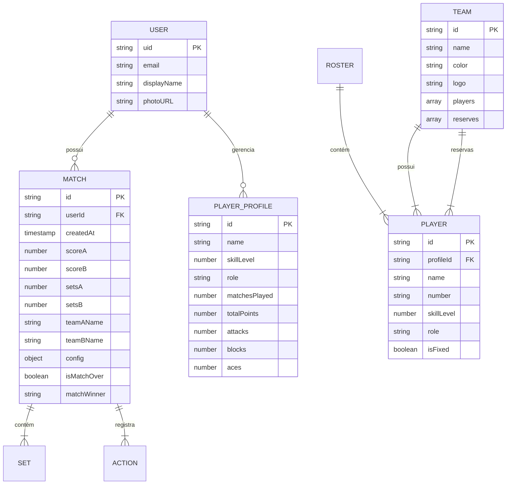

# Documentação Técnica - VolleyScore Pro v2

## 1. Visão Geral do Projeto

**VolleyScore Pro v2** é uma aplicação completa para marcação e gerenciamento de partidas de vôlei, com suporte tanto para **Indoor** quanto para **Beach Volleyball**. O aplicativo oferece placar digital interativo, estatísticas detalhadas de jogadores, comandos de voz com IA, rotação inteligente de times, sincronização em tempo real (VolleyLink Live) e exportação de relatórios em PDF.

### Tech Stack Completa

#### **Frontend**
- **React 19.0** - Biblioteca UI principal
- **TypeScript 5.3** - Tipagem estática
- **Vite 5.1** - Build tool e bundler
- **Tailwind CSS 3.4** - Framework de estilização (modo dark habilitado)
- **Framer Motion 11.0** - Animações e transições
- **Lucide React** - Biblioteca de ícones

#### **Backend e Serviços**
- **Firebase 10.8**
  - **Firestore** - Banco de dados NoSQL em tempo real (com cache persistente offline)
  - **Firebase Auth** - Autenticação de usuários (Google OAuth)
  - **Firebase Storage** - Armazenamento de arquivos (logos, avatares)
- **Google Gemini AI** (`@google/genai`) - IA para análise de partidas e comandos de voz

#### **Mobile (Híbrido)**
- **Capacitor 6.0** - Framework para compilação mobile (Android/iOS)
- **Capacitor Plugins:**
  - **AdMob** - Monetização com anúncios
  - **Speech Recognition** - Reconhecimento de voz nativo
  - **Text-to-Speech** - Narração de placar
  - **Haptics** - Feedback tátil
  - **Keep Awake** - Manter tela ativa durante partidas
  - **Screen Orientation** - Controle de orientação
  - **Share** - Compartilhamento nativo
  - **Filesystem** - Salvamento de arquivos locais
  - **Preferences** - Armazenamento persistente de configurações

#### **Gerenciamento de Estado**
- **Zustand 4.5** - State management global (para histórico e rosters)
- **Context API** - Contextos React nativos (GameContext, AuthContext, ModalContext, etc.)
- **Reducers** - Lógica complexa de jogo (gameReducer, rosterReducer)

#### **Bibliotecas Adicionais**
- **jsPDF** - Geração de relatórios PDF
- **html-to-image** - Captura de screenshots para compartilhamento
- **idb-keyval** - IndexedDB simplificado (cache offline)
- **@dnd-kit** - Drag and drop para reordenar jogadores
- **react-virtuoso** - Renderização virtualizada de listas longas

#### **Infraestrutura e Deploy**
- **Firebase Hosting** - Hospedagem Web
- **Vercel** - Deploy alternativo (configurado)
- **PWA** (Progressive Web App) - Instalável e funciona offline

#### **Testes e Quality**
- **Playwright** - Testes end-to-end automatizados

---

## 2. Estrutura do Projeto

O projeto segue uma **arquitetura baseada em features/domínios**, com separação clara entre lógica de negócio, UI e serviços.

```
VolleyScore-Pro-Versão-1.0---Official/
│
├── android/                  # Projeto Android nativo (Capacitor)
├── docs/                     # Documentação adicional e assets
├── public/                   # Assets estáticos (logos, ícones PWA)
├── src/
│   ├── App.tsx               # ✨ REFATORADO (509→46 linhas) - Apenas providers
│   ├── index.tsx             # Entry point
│   ├── index.css             # Estilos globais e Tailwind imports
│   │
│   ├── theme/                # Design System (cores, tokens)
│   │   └── colors.ts         # Paleta de cores Neo-Glass Premium
│   │
│   ├── screens/              # ✨ NOVO - Telas principais
│   │   ├── GameScreen.tsx    # UI principal do jogo (290 linhas)
│   │   ├── BroadcastScreen.tsx  # Modo transmissão OBS/Spectator
│   │   └── index.ts          # Re-exports
│   │
│   ├── components/           # Componentes React organizados por feature
│   │   ├── Ads/              # Componentes de anúncios (AdMob)
│   │   ├── Broadcast/        # ✨ NOVO - Overlays para streaming (OBS)
│   │   │   ├── BroadcastOverlay.tsx  # Overlay transparente para OBS
│   │   │   └── ObsScoreDisplay.tsx   # Display full-screen (horizontal/vertical)
│   │   ├── Court/            # Quadra tática (posicionamento)
│   │   ├── Fullscreen/       # UI de tela cheia (HUD, controles)
│   │   ├── History/          # Visualização de histórico (timeline, gráficos)
│   │   ├── Settings/         # Telas de configuração
│   │   ├── Share/            # Compartilhamento de resultados
│   │   ├── Social/           # Ranking global
│   │   ├── TeamManager/      # Gerenciamento de times e jogadores
│   │   ├── containers/       # ✨ NOVO - Container components
│   │   │   └── ScoreCardContainer.tsx  # Wrapper para ScoreCards
│   │   ├── modals/           # Modais (confirmações, match over, etc.)
│   │   ├── tutorial/         # ✨ REFATORADO - Onboarding
│   │   │   ├── scenes/       # 12 cenas individuais (TeamComposition, PlayerStats, etc.)
│   │   │   ├── visuals/      # Componentes visuais (AppScenes, TeamScenes, etc.)
│   │   │   ├── MotionScenes.tsx  # Re-export facade
│   │   │   └── TutorialVisuals.tsx  # Mapeador de visuais
│   │   └── ui/               # Componentes reutilizáveis (buttons, badges, etc.)
│   │       └── ModalHeader.tsx  # Header padrão para modais
│   │
│   ├── contexts/             # React Contexts (estado global)
│   │   ├── GameContext.tsx   # Estado da partida (placar, sets, config)
│   │   ├── AuthContext.tsx   # Autenticação Firebase
│   │   ├── ThemeContext.tsx  # ✨ NOVO - Dark Mode / Light Mode (persistente)
│   │   ├── LayoutContext.tsx # Gerenciamento de layout
│   │   ├── ModalContext.tsx  # Gerenciamento de modais
│   │   ├── NotificationContext.tsx  # Toasts e notificações
│   │   ├── TimerContext.tsx  # Cronômetro de partida
│   │   └── LanguageContext.tsx  # Internacionalização (i18n)
│   │
│   ├── reducers/             # Lógica de estado complexa
│   │   ├── gameReducer.ts    # Orquestrador principal
│   │   ├── scoring.ts        # Lógica de pontuação
│   │   ├── roster.ts         # Gerenciamento de elencos e rotação
│   │   └── meta.ts           # Metadados e configurações
│   │
│   ├── services/             # Camada de serviços (I/O, integrações)
│   │   ├── firebase.ts       # Inicialização Firebase (Auth, Firestore, Storage)
│   │   ├── AnalysisEngine.ts # Análise de momentum e estatísticas
│   │   ├── GeminiCommandService.ts  # IA Gemini para comandos de voz
│   │   ├── VoiceRecognitionService.ts  # Speech-to-text nativo
│   │   ├── TTSService.ts     # Text-to-speech (narração de placar)
│   │   ├── SyncEngine.ts     # Sincronização real-time (VolleyLink Live)
│   │   ├── TimeoutSyncService.ts  # ✨ NOVO - Sync de timeouts separado
│   │   ├── PDFService.ts     # Geração de relatórios
│   │   ├── ImageService.ts   # Captura de screenshots
│   │   ├── AdService.ts      # AdMob (banner, interstitial, rewarded)
│   │   ├── AudioService.ts   # Sons de efeito (tap, undo, set-win)
│   │   ├── PlatformService.ts  # Detecção de plataforma (web/native)
│   │   ├── BackupService.ts  # Backup/restore
│   │   └── io.ts             # I/O local (IndexedDB + Filesystem)
│   │
│   ├── hooks/                # Custom React Hooks (33 hooks)
│   │   ├── useSafeAreaInsets.ts  # ✨ NOVO - Leitura de safe areas
│   │   ├── useActiveTimeout.ts   # ✨ NOVO - Gerenciamento de timeout ativo
│   │   ├── useTimeoutSync.ts     # ✨ NOVO - Sync de timeout (host)
│   │   ├── useRemoteTimeoutSync.ts  # ✨ NOVO - Sync de timeout (spectator)
│   │   ├── useVolleyGame.ts  # ✨ REFATORADO - Facade pattern
│   │   ├── useGameState.ts   # ✨ NOVO - Estado do jogo isolado
│   │   ├── useGamePersistence.ts  # ✨ NOVO - Persistência split-state
│   │   ├── useGameActions.ts # ✨ NOVO - Actions wrapped
│   │   ├── useTeamGenerator.ts  # ✨ NOVO - Geração de times
│   │   ├── useVoiceControl.ts  # Controle por voz
│   │   ├── useGameAudio.ts   # Reprodução de sons
│   │   ├── useHaptics.ts     # Feedback tátil
│   │   ├── useKeepAwake.ts   # Manter tela ativa
│   │   ├── useScoreAnnouncer.ts  # TTS automático
│   │   ├── usePlatform.ts    # Detecção web/mobile
│   │   ├── useSensoryFX.ts   # Efeitos sensoriais combinados
│   │   ├── useNativeIntegration.ts  # Integração com Capacitor
│   │   └── ... (24 hooks adicionais)
│   │
│   ├── stores/               # Zustand stores
│   │   ├── historyStore.ts   # Histórico de partidas
│   │   └── rosterStore.ts    # Templates de times salvos
│   │
│   ├── types/                # Definições TypeScript
│   │   ├── domain.ts         # Tipos de domínio (GameState, Player, Team, etc.)
│   │   ├── services.ts       # Tipos de serviços (SyncRole, etc.)
│   │   └── ui.ts             # Tipos de UI
│   │
│   ├── utils/                # Funções utilitárias
│   │   └── animations.ts, formatters.ts, validators.ts, colors.ts, etc.
│   │
│   └── constants.ts          # Feature flags e constantes globais
│
├── firestore.rules           # Regras de segurança Firestore
├── firestore.indexes.json    # Índices compostos Firestore
├── storage.rules             # Regras de segurança Storage
├── firebase.json             # Configuração Firebase Hosting
├── capacitor.config.ts       # Configuração Capacitor (mobile)
├── vite.config.ts            # Configuração Vite (build, PWA)
├── tailwind.config.js        # Configuração Tailwind CSS
├── tsconfig.json             # Configuração TypeScript
└── package.json              # Dependências e scripts
```

### Padrões Arquiteturais

1. **Screen Separation Pattern** ✨ NOVO:
   - **App.tsx** (46 linhas): Apenas composição de providers (ThemeProvider, AuthProvider, GameProvider, etc.)
   - **GameScreen.tsx** (290 linhas): Toda a UI e lógica de orquestração do jogo
   - **BroadcastScreen.tsx**: Tela dedicada para modo transmissão OBS/Spectator
   - **Benefício**: Separação clara de responsabilidades, facilita testes e manutenção

2. **Context + Reducers**: Estado complexo gerenciado por reducers puros, exposto via Context API.
   - Reducers divididos por domínio: `scoring.ts`, `roster.ts`, `meta.ts`
   - `gameReducer.ts` atua como orquestrador principal

3. **Feature-Based Organization**: Componentes agrupados por funcionalidade, não por tipo.
   - Tutorial dividido em `scenes/` (12 cenas) e `visuals/` (4 categorias)
   - Broadcast components isolados em `components/Broadcast/`

4. **Custom Hooks Especializados** ✨ REFATORADO:
   - **Facade Pattern**: `useVolleyGame` compõe 4 hooks especializados
   - **Single Responsibility**: Cada hook tem uma responsabilidade única
   - Exemplos: `useActiveTimeout`, `useGameState`, `useGamePersistence`, `useGameActions`

5. **Service Layer**: Toda I/O (Firebase, IA, Storage) isolada em serviços testáveis.
   - Serviços singleton: `SyncEngine`, `TimeoutSyncService`
   - Separação de concerns: sync de estado vs sync de timeout

6. **Container Pattern**: `ScoreCardContainer` reduz prop drilling em ~20 props por card.

7. **Atomic Design (parcial)**: Componentes UI genéricos em `components/ui/` (ModalHeader, Button, etc.).

---

## 3. Banco de Dados e Modelagem

### Firestore Collections

O app usa **Firestore** como banco de dados principal, com as seguintes collections:

```
/users/{userId}
  ├── /matches/{matchId}               # Histórico de partidas do usuário
  │   ├── /sets/{setId}                 # Sets da partida
  │   └── /actions/{actionId}           # Ações (pontos, timeouts)
  └── /profiles/{profileId}             # Perfis de jogadores cadastrados

/rosters/{rosterId}                     # Times salvos (templates)
  └── /players/{playerId}               # Jogadores do roster

/public/{document}                      # Dados públicos (rankings globais)

/live_matches/{sessionId}               # Sessões de transmissão ao vivo (VolleyLink Live)
```

### Diagrama de Relacionamentos (Mermaid)



### Principais Entidades

#### **GameState** (Estado Principal do Jogo)
- `gameId`: string - Identificador único da sessão de jogo (timestamp-based)
- `gameCreatedAt`: number - Data de criação da sessão (Unix timestamp)
- `teamAName`, `teamBName`: Nomes dos times
- `scoreA`, `scoreB`: Placar do set atual
- `setsA`, `setsB`: Sets vencidos
- `currentSet`: Número do set atual
- `servingTeam`: Time que está sacando ('A' | 'B')
- `config`: Configurações da partida (GameConfig)
- `teamARoster`, `teamBRoster`: Elencos em quadra
- `queue`: Fila de times para rotação (modo Balanced)
- `actionLog[]`: Histórico de ações (para undo)
- `matchLog[]`: Log persistente da partida
- `lastSnapshot?`: Snapshot do estado anterior (para undo de set)
- `syncRole`: 'none' | 'host' | 'spectator' (VolleyLink Live)

#### **GameConfig** (Configurações)
- `mode`: 'indoor' | 'beach'
- `maxSets`: 1 | 3 | 5
- `pointsPerSet`: 15 | 21 | 25
- `hasTieBreak`: boolean
- `deuceType`: 'standard' | 'sudden_death_3pt'
- `rotationMode`: 'standard' | 'balanced'
- `voiceControlEnabled`: boolean
- `enablePlayerStats`: boolean (Scout Mode)
- `announceScore`: boolean (TTS automático)
- `adsRemoved`: boolean (Premium)
- `developerMode`: boolean

#### **Player** (Jogador)
- `id`: string (UUID)
- `profileId?`: string (link para ProfileStats)
- `name`: string
- `number?`: string (camisa)
- `skillLevel`: number (1-10)
- `role`: 'setter' | 'hitter' | 'middle' | 'libero' | 'none'
- `isFixed`: boolean (fixado na rotação Balanced)

#### **Team** (Time)
- `id`: string
- `name`: string
- `color`: string (hex ou Tailwind color)
- `logo?`: string (URL Firebase Storage)
- `players[]`: Jogadores em quadra
- `reserves[]`: Banco de reservas

---

## 4. Principais Funcionalidades e Fluxos

### 4.1. Dark Mode / Light Mode

**Implementação**: `ThemeContext` com persistência local (localStorage)

**Fluxo**:
1. Usuário alterna tema via toggle (Settings ou UI)
2. `ThemeContext.toggleTheme()` atualiza estado
3. `useEffect` aplica classe `dark` ou `light` no `<html>` root
4. Tema é persistido em `localStorage` (chave: `volleyscore-theme`)
5. Tailwind CSS aplica estilos condicionais via `dark:` modifier

**Padrão**: App inicia em **dark mode** por padrão (otimizado para uso em quadras com pouca luz).

### 4.2. Autenticação

**Provedor**: Firebase Auth com Google OAuth

**Fluxo**:
1. Usuário clica em "Login com Google" (componente `AuthModal`)
2. `AuthContext` chama `signInWithPopup(auth, googleProvider)`
3. Firebase retorna `user.uid` e `user.displayName`
4. Context armazena estado do usuário
5. Firestore cria/atualiza documento `/users/{uid}`

**Importante**: Autenticação é **opcional** para uso básico. Funcionalidades que exigem login:
- Salvar histórico de partidas na nuvem
- VolleyLink Live (transmissão)
- Ranking global
- Sincronização entre dispositivos

### 4.3. Fluxo Principal: Marcar Ponto

```
1. [UI] Usuário toca no botão "+" do Team A (ScoreCardNormal)
2. [Component] Dispara handleAddPointGeneric('A', playerId?, skill?)
3. [Context] GameContext.addPoint() chama dispatch({ type: 'POINT', team: 'A', metadata })
4. [Reducer] gameReducer.ts:
   - Incrementa scoreA
   - Verifica se set acabou (scoreA >= 25 && diff >= 2)
   - Se sim: incrementa setsA, reseta placar, vai pro próximo set
   - Verifica se match acabou (setsA >= config.maxSets / 2 + 1)
   - Atualiza servingTeam (se aplicável)
   - Registra ação em actionLog[] (para undo)
   - Atualiza estatísticas do jogador (se profileId existe)
5. [Side Effects]
   - useGameAudio() reproduz som "tap"
   - useHaptics() vibra dispositivo (se mobile)
   - useScoreAnnouncer() narra placar (se TTS ativo)
   - SyncEngine.broadcastState() envia para espectadores (se VolleyLink Live)
6. [UI] React re-renderiza com novo estado
```

### 4.3.1. Sistema de Feedback Visual (Halo)

**Componente**: `HaloBackground.tsx`

O "Halo" é um feedback visual crucial que indica estados do jogo através de cores e animações atrás do placar.

**Estados Suportados**:
1.  **Serving (Saque)**: Brilho constante/suave na cor do time que saca.
2.  **Scoring (Ponto)**: Flash momentâneo ou brilho sólido indicando o último pontuador.
3.  **Critical (Set/Match Point)**: Pulsação intensa ("Heartbeat") em cores de alerta (Amber/Gold).

**Arquitetura de Cores**:
- Utiliza `utils/colors.ts` -> `theme.halo` para consistência.
- Cores críticas (Match Point) sobrescrevem a cor do time com Amber/Gold.


### 4.4. Rotação Inteligente de Times (Modo Balanced)

**Propósito**: Em jogos recreativos com muitos jogadores, o app rotaciona automaticamente times equilibrados.

**Algoritmo** (`rosterReducer.ts`):
1. A cada X pontos (configurável), dispara `ROTATE_TEAMS`
2. Time A (atual) sai para a fila (`queue[]`)
3. Time B permanece em quadra (advantage do vencedor)
4. Primeiro time da fila entra como novo Time A
5. **Rebalanceamento**: Jogadores com `isFixed: false` são redistribuídos entre os times usando algoritmo de balanceamento por `skillLevel`
6. Registra `RotationReport` (quem saiu, quem entrou, quem foi "roubado")

### 4.5. Comandos de Voz com IA (Gemini)

**Fluxo**:
1. Usuário pressiona microfone (FloatingControlBar)
2. `VoiceRecognitionService` escuta fala (Capacitor Speech Recognition)
3. Transcrição enviada para `GeminiCommandService`
4. Gemini AI interpreta intent:
   - "Ponto para o Time A" → `{ type: 'point', team: 'A', confidence: 0.95 }`
   - "João fez um ace" → `{ type: 'point', team: 'A', player: { name: 'João' }, skill: 'ace' }`
   - "Desfazer" → `{ type: 'undo' }`
5. `useVoiceControl` hook executa ação correspondente
6. Notificação visual confirma ação

**Contexto enviado para IA**:
- Nomes dos times
- Lista de jogadores (para reconhecer nomes)
- Time que está sacando
- Idioma do usuário

### 4.6. VolleyLink Live (Sincronização Real-Time)

**Arquitetura**: Host/Spectator via Firestore real-time

**Fluxo Host**:
1. Host clica em "Transmitir" (Modal LiveSync)
2. Cria sessão em `/live_matches/{code}` com `hostUid`
3. `SyncEngine.hostMatch()` salva `GameState` completo
4. A cada mudança, `broadcastState()` atualiza Firestore (debounce 500ms)
5. Compartilha código de 6 dígitos com espectadores

**Fluxo Spectator**:
1. Espectador insere código de sessão
2. `SyncEngine.subscribeToMatch(code)` escuta snapshot Firestore
3. A cada update, `setState({ type: 'LOAD_STATE', payload: remoteState })`
4. UI sincroniza em ~500ms (latência típica Firestore)

**Otimizações**:
- Throttling de writes (máx 2 writes/segundo)
- Timeouts sincronizados separadamente (evita sobrecarga)
- Espectadores têm `syncRole: 'spectator'` (UI bloqueada para edição)

### 4.7. Broadcast Mode (OBS Integration) ✨ NOVO

**Propósito**: Permitir transmissão de partidas via OBS Studio ou visualização por espectadores.

**Componentes**:

#### **BroadcastOverlay** (Overlay Transparente)
- **Uso**: Overlay para OBS com fundo transparente
- **Layout**: Scoreboard compacto na parte inferior da tela
- **Features**:
  - Progress bars animadas (progresso até target de pontos)
  - Indicador de serving team (bola de vôlei rotativa)
  - Set pills (indicadores de sets vencidos)
  - Status dinâmico (SET POINT, MATCH POINT, SUDDEN DEATH)
  - Glassmorphism (backdrop blur + transparência)

#### **ObsScoreDisplay** (Display Full-Screen)
- **Uso**: Display dedicado para OBS (sem transparência)
- **Layouts**: Horizontal (padrão) ou Vertical
- **Otimizações**:
  - Ultra-low latency updates
  - Legibilidade à distância (fontes grandes)
  - Alto contraste para green screen
  - Sem elementos interativos (display-only)

**Fluxo de Acesso**:
1. **Spectator Mode**: `?mode=broadcast&code=SESSION_CODE`
   - Carrega `BroadcastScreen.tsx`
   - Escuta estado remoto via `SyncEngine.subscribeToMatch()`
2. **OBS Overlay**: `?mode=broadcast&obsLayout=horizontal` ou `vertical`
   - Renderiza `ObsScoreDisplay` com layout escolhido
   - Ideal para streaming (1920x1080)

**URL Parameters**:
- `mode=broadcast`: Ativa modo transmissão
- `code=XXXXXX`: Código de sessão (6 dígitos)
- `obsLayout=horizontal|vertical`: Layout do OBS display

---

### 4.8. Gerenciamento de Sessão e Undo ✨ NOVO (Lote 3)

**Problema Resolvido**: Antes, o botão "Desfazer" (Undo) podia restaurar estados de partidas anteriores, causando comportamento inesperado.

**Solução Implementada**: Sistema de identificação de sessão com `gameId`.

#### **Campos Adicionados ao GameState**
- `gameId: string` - Identificador único de cada sessão de jogo (gerado via `Date.now().toString()`)
- `gameCreatedAt: number` - Timestamp de criação da sessão

#### **Fluxo de Proteção**

```
1. [Inicialização] App carrega estado salvo (com gameId antigo)
2. [useVolleyGame] currentGameIdRef é inicializado com gameId do estado carregado
3. [Nova Partida] Usuário clica em "Zerar" ou "Próximo":
   - startNewGame() ou safeRotateTeams() gera novo gameId
   - Atualiza currentGameIdRef ANTES do dispatch
   - Dispatch limpa actionLog[], matchLog[], lastSnapshot
4. [Undo Seguro] Quando safeUndo() é chamado:
   - Verifica se stateRef.gameId === currentGameIdRef
   - Se diferente: BLOQUEIA undo (estado obsoleto)
   - Se igual: permite undo normal
```

#### **Arquivos Modificados**

| Arquivo | Alteração |
|---------|-----------|
| `src/types/domain.ts` | Adicionados `gameId`, `gameCreatedAt` ao `GameState`; `RESET_MATCH` e `ROTATE_TEAMS` aceitam `gameId?` |
| `src/hooks/useGameState.ts` | `INITIAL_STATE` inclui `gameId` e `gameCreatedAt` iniciais |
| `src/reducers/meta.ts` | `RESET_MATCH` gera novo `gameId`, limpa `lastSnapshot` |
| `src/reducers/roster.ts` | `ROTATE_TEAMS` gera novo `gameId`, limpa `lastSnapshot` |
| `src/hooks/useVolleyGame.ts` | Implementa `currentGameIdRef`, `safeUndo`, `startNewGame`, `safeRotateTeams` |

#### **Funções Wrapper em useVolleyGame.ts**

```typescript
// safeUndo - Valida sessão antes de permitir undo
const safeUndo = useCallback(() => {
  if (stateRef.current.gameId !== currentGameIdRef.current) {
    console.warn('[VolleyGame] UNDO BLOCKED: State GameID mismatch.');
    return;
  }
  dispatch({ type: 'UNDO' });
}, [dispatch, stateRef]);

// startNewGame - Atualiza ref antes de reset
const startNewGame = useCallback(() => {
  const newGameId = Date.now().toString();
  currentGameIdRef.current = newGameId;
  dispatch({ type: 'RESET_MATCH', gameId: newGameId });
}, [dispatch]);

// safeRotateTeams - Atualiza ref antes de rotação
const safeRotateTeams = useCallback(() => {
  const newGameId = Date.now().toString();
  currentGameIdRef.current = newGameId;
  dispatch({ type: 'ROTATE_TEAMS', gameId: newGameId });
}, [dispatch]);
```

#### **Console Logs de Debug**
- `[VolleyGame] Started New Game: <gameId>` - Nova partida iniciada
- `[VolleyGame] Rotated Teams - New Game: <gameId>` - Rotação com nova sessão
- `[VolleyGame] UNDO BLOCKED: State GameID mismatch.` - Undo bloqueado (proteção ativa)

---

### 4.9. Exportação de Relatórios

**Formatos**:
- **PDF**: jsPDF gera relatório com estatísticas (PDFService)
- **Imagem**: html-to-image captura screenshot (ImageService)
- **JSON**: Backup completo do GameState (BackupService)

**Fluxo Export PDF**:
1. Usuário clica "Exportar PDF" (MatchOverModal)
2. `PDFService.generate()` cria documento com:
   - Placar final
   - Estatísticas de sets
   - Momentum graph (gráfico de pontos ao longo do tempo)
   - Estatísticas de jogadores (se Scout Mode ativo)
3. Salva via `Filesystem.writeFile()` (mobile) ou Download (web)

---

## 5. Variáveis de Ambiente e Configuração

### Arquivo `.env` (Raiz do projeto)

```env
# Firebase Configuration
VITE_FIREBASE_API_KEY=AIzaSy...
VITE_FIREBASE_AUTH_DOMAIN=volleyscore-pro.firebaseapp.com
VITE_FIREBASE_PROJECT_ID=volleyscore-pro
VITE_FIREBASE_STORAGE_BUCKET=volleyscore-pro.appspot.com
VITE_FIREBASE_MESSAGING_SENDER_ID=123456789
VITE_FIREBASE_APP_ID=1:123456789:web:abcdef
VITE_FIREBASE_MEASUREMENT_ID=G-XXXXXXXXXX

# Google Gemini AI (opcional, para comandos de voz avançados)
VITE_GEMINI_API_KEY=AIzaSy...
```

### Variáveis de Build

- **`import.meta.env.MODE`**: 'development' | 'production'
- **`import.meta.env.VITE_*`**: Todas as variáveis com prefixo `VITE_` são expostas no frontend

### Feature Flags (`src/constants.ts`) ✨ ATUALIZADO

**Estratégia PlayStore v1.0**: Lançamento focado em funcionalidades core, features premium desabilitadas.

```typescript
export const FEATURE_FLAGS = {
  // Real-time Broadcasting (VolleyLink Live)
  // ❌ Disabled for initial PlayStore release to focus on core functionality
  ENABLE_LIVE_SYNC: false,
  ENABLE_BROADCAST_OVERLAY: false,
  
  // Artificial Intelligence / Gemini Integration
  // ❌ Disabled for initial release; requires additional optimization
  ENABLE_AI_VOICE_COMMANDS: false,
  ENABLE_GEMINI_SERVICE: false,
  
  // Cloud Sync (Firebase sync - can stay enabled for backup/auth)
  // ✅ Enabled for backup and authentication
  ENABLE_CLOUD_SYNC: true,
  ENABLE_GOOGLE_AUTH: true,
  
  // Developer / Debug Features
  // ❌ Disabled for production
  ENABLE_DEVELOPER_MODE: false,
  ENABLE_CONSOLE_LOGS: false,
};
```

**Importante**: Features desabilitadas via flags ainda estão implementadas no código, mas não são executadas em runtime. Isso permite ativação rápida em versões futuras.

---

## 6. Padrões de Código

### 6.1. Design System (Cores)

**Arquivo**: `src/theme/colors.ts`

**Regra Crítica**: ❌ **NUNCA use cores hardcoded** (ex: `#6366f1`, `bg-indigo-500`). ✅ **SEMPRE importe do Design System**.

**Paleta Neo-Glass Premium**:
- **Backgrounds**: `colors.background.primary` (slate-950), `secondary` (slate-900), `tertiary` (slate-800)
- **Accent Colors**: `colors.accent.teamA.default` (indigo-500), `colors.accent.teamB.default` (rose-500)
- **Text**: `colors.text.primary` (slate-50), `secondary` (slate-300), `tertiary` (slate-400)
- **States**: `colors.states.success` (emerald-500), `error` (red-500), `warning` (amber-500)
- **Borders**: `colors.border.subtle` (rgba glassmorphism)
- **Gradients**: `colors.gradients.teamA`, `teamB`, `neutral`

**Exemplo de Uso**:
```tsx
import { colors } from '@/theme/colors';

<div style={{ backgroundColor: colors.background.secondary }}>
  <h1 style={{ color: colors.accent.teamA.default }}>Team A</h1>
</div>
```

**Benefícios**:
- ✅ Consistência visual em todo o app
- ✅ Fácil manutenção (alterar paleta em um único lugar)
- ✅ Type-safe (TypeScript autocomplete)

### 6.2. Estilização (Tailwind CSS)

- **Dark Mode**: Habilitado via `class` strategy (`darkMode: 'class'`). Controlado por `ThemeContext`.
- **Cores Dinâmicas**: Tailwind safelist permite cores dinâmicas de times (ex: `text-${color}-500`)
- **Safe Area**: Gerenciada via `useSafeAreaInsets()` hook (lê CSS `env(safe-area-inset-*)`)
- **Animações**: Framer Motion para transições complexas, Tailwind para hover/focus simples

**Exemplo**:
```tsx
<div className="bg-slate-900 dark:bg-slate-950 text-white p-4 rounded-xl">
  <h1 className={`text-${teamColor}-500 font-bold`}>Team A</h1>
</div>
```

### 6.3. Padrão: ModalHeader Component

**Arquivo**: `src/components/ui/ModalHeader.tsx`

**Uso**: Componente reutilizável para headers de modais com safe area automática.

**Features**:
- ✅ **Safe Area Automática**: Usa `useSafeAreaInsets()` para adicionar padding-top dinâmico (evita notch)
- ✅ **Sticky Header**: Permanece fixo no topo durante scroll
- ✅ **Glassmorphism**: Background blur + transparência
- ✅ **Shadow on Scroll**: Adiciona sombra quando `scrolled={true}`
- ✅ **Layout Flexível**: Suporta `title`, `subtitle`, `rightContent`, `centerContent`

**Exemplo de Uso**:
```tsx
import { ModalHeader } from '@/components/ui/ModalHeader';

<ModalHeader
  title="Configurações"
  subtitle="Personalize sua experiência"
  onClose={() => setIsOpen(false)}
  rightContent={<SaveButton />}
  scrolled={scrollY > 10}
/>
```

**Regra**: Todos os novos modais devem usar `ModalHeader` (não criar headers customizados).

### 6.4. Nomenclatura

- **Componentes**: PascalCase (ex: `ScoreCardNormal.tsx`)
- **Hooks**: camelCase com prefixo `use` (ex: `useVoiceControl.ts`)
- **Services**: PascalCase (ex: `GeminiCommandService.ts`)
- **Tipos**: PascalCase (ex: `GameState`, `PlayerProfile`)
- **Variáveis**: camelCase (ex: `teamAName`, `isMatchOver`)

### 6.5. TypeScript Strict Mode

- `strict: true` ativado
- Todos os tipos explícitos em funções públicas
- `any` evitado (exceção: integrações de terceiros sem tipagem)

### 6.6. Context Pattern

**Boas Práticas**:
- Separar Context em 3 partes: `Provider`, `useContext`, `State`
- Evitar re-renders desnecessários com `useMemo` nos valores do Context
- Separar estado por domínio (ex: `GameContext` != `AuthContext`)

**Exemplo** (`GameContext.tsx`):
```typescript
// 1. Criar Context
const GameContext = createContext<GameState | undefined>(undefined);

// 2. Provider com reducer
export const GameProvider: FC = ({ children }) => {
  const [state, dispatch] = useReducer(gameReducer, initialState);
  const value = useMemo(() => ({ state, dispatch }), [state]);
  return <GameContext.Provider value={value}>{children}</GameContext.Provider>;
};

// 3. Hook customizado
export const useGameState = () => {
  const context = useContext(GameContext);
  if (!context) throw new Error('useGameState must be used within GameProvider');
  return context;
};
```

### 6.7. Reducers Puros

- Todos os reducers devem ser **pure functions** (sem side effects)
- Side effects (Firebase, audio, haptics) executados em `useEffect` após re-render
- Ações tipadas com union types (ex: `GameAction = { type: 'POINT', team: TeamId } | ...`)

### 6.8. Async/Await em Services

- Toda I/O (Firestore, Storage, APIs) usa `async/await`
- Erros tratados com `try/catch` e logs

**Exemplo**:
```typescript
export const saveMatch = async (userId: string, matchData: Match) => {
  try {
    const docRef = doc(db, 'users', userId, 'matches', matchData.id);
    await setDoc(docRef, matchData);
    console.log('[HistoryStore] Match saved:', matchData.id);
  } catch (error) {
    console.error('[HistoryStore] Save failed:', error);
    throw error;
  }
};
```

### 6.9. Mobile-First Responsive

- Layouts usam Flexbox/Grid com breakpoints Tailwind (`sm:`, `md:`, `lg:`)
- `landscape:` modifier para orientação horizontal
- Componentes adaptam UI (ex: `ScoreCardNormal` vs `ScoreCardFullscreen`)

### 6.10. Architectural Pattern - Screen Separation ✨ NOVO

**Motivação**: App.tsx original tinha 509 linhas com lógica de jogo, UI e providers misturados.

**Solução Implementada**:

#### **App.tsx** (46 linhas) - Provider Composition Only
```tsx
function App() {
  return (
    <LayoutProvider>
      <ThemeProvider>
        <ErrorBoundary>
          <AuthProvider>
            <TimerProvider>
              <GameProvider>
                <ModalProvider>
                  <NotificationProvider>
                    <GameScreen />
                  </NotificationProvider>
                </ModalProvider>
              </GameProvider>
            </TimerProvider>
          </AuthProvider>
        </ErrorBoundary>
      </ThemeProvider>
    </LayoutProvider>
  );
}
```

**Responsabilidade**: Apenas composição de providers (Context API).

---

#### **GameScreen.tsx** (290 linhas) - Main Orchestrator

**Responsabilidades**:
- Consumir todos os contexts (GameContext, AuthContext, ModalContext, etc.)
- Orquestrar hooks customizados (useGameAudio, useHaptics, useScoreAnnouncer, etc.)
- Renderizar UI principal do jogo
- Gerenciar estado local de UI (fullscreen, interacting team, etc.)
- Detectar modo broadcast e renderizar tela apropriada

**Exemplo de Estrutura**:
```tsx
export const GameScreen = () => {
  // 1. Context consumption
  const { state, dispatch } = useGameState();
  const { user } = useAuth();
  const { openModal, closeModal, activeModal } = useModal();
  
  // 2. Custom hooks
  const audio = useGameAudio(config);
  const haptics = useHaptics(true);
  const { activeTeam, startTimeout, stopTimeout } = useActiveTimeout();
  
  // 3. Local UI state
  const [isFullscreen, setIsFullscreen] = useState(false);
  
  // 4. Broadcast mode detection
  if (isBroadcastMode) {
    return <BroadcastOverlay state={state} />;
  }
  
  // 5. Main UI rendering
  return (
    <div className="app-container">
      <ScoreCardContainer teamId="A" />
      <ScoreCardContainer teamId="B" />
      {/* ... */}
    </div>
  );
};
```

---

#### **BroadcastScreen.tsx** (35 linhas) - Dedicated Broadcast UI

**Responsabilidade**: Tela simplificada para modo espectador/OBS.

---

**Benefícios da Separação**:
- ✅ **Testabilidade**: Providers e UI podem ser testados separadamente
- ✅ **Manutenibilidade**: Mudanças em providers não afetam lógica de jogo
- ✅ **Legibilidade**: Cada arquivo tem responsabilidade clara
- ✅ **Performance**: Facilita code-splitting e lazy loading
- ✅ **Escalabilidade**: Fácil adicionar novas telas (SettingsScreen, HistoryScreen, etc.)

---

### 6.11. Hook Composition Pattern - Facade ✨ NOVO

**Problema**: `useVolleyGame` original tinha 356 linhas com múltiplas responsabilidades.

**Solução**: Dividir em 4 hooks especializados + 1 facade.

#### **Hooks Especializados**:

1. **useGameState.ts** (~60 linhas)
   - `INITIAL_STATE` definition
   - `useReducer` setup
   - `stateRef` para acesso síncrono

2. **useGamePersistence.ts** (~110 linhas)
   - Load state from localStorage/Firestore
   - Save state (split-state strategy)
   - Auto-save on changes

3. **useGameActions.ts** (~260 linhas)
   - Todas as actions (addPoint, undo, swapSides, etc.)
   - Wrapped com `useCallback` para performance

4. **useTeamGenerator.ts** (~95 linhas)
   - `generateTeams()` - Criação de times balanceados
   - `balanceTeams()` - Rebalanceamento por skill level

#### **Facade Hook**:

```typescript
// useVolleyGame.ts (126 linhas)
export const useVolleyGame = () => {
  // Compose specialized hooks
  const { state, dispatch, stateRef } = useGameState();
  const { loadState, saveState } = useGamePersistence(state, dispatch);
  const actions = useGameActions(state, dispatch, stateRef);
  const { generateTeams, balanceTeams } = useTeamGenerator();
  
  // Return unified interface (100% backward compatible)
  return {
    state,
    dispatch,
    ...actions,
    generateTeams,
    balanceTeams,
    loadState,
    saveState,
  };
};
```

**Benefícios**:
- ✅ **Single Responsibility**: Cada hook tem uma responsabilidade
- ✅ **Testabilidade**: Hooks podem ser testados isoladamente
- ✅ **Reusabilidade**: `useGamePersistence` pode ser usado em outros contextos
- ✅ **Backward Compatibility**: Interface pública não mudou

---

### 6.12. Timeout Management - Separated Concerns ✨ NOVO

**Arquitetura**: Estado local + Sync separado.

#### **useActiveTimeout** - Local State Management
```typescript
const { 
  activeTeam,      // 'A' | 'B' | null
  secondsLeft,     // Countdown timer
  isMinimized,     // UI state
  startTimeout,    // (teamId, duration?) => void
  stopTimeout,     // () => void
  minimize,        // () => void
  maximize         // () => void
} = useActiveTimeout();
```

**Responsabilidade**: Gerenciar estado do timeout ativo (timer, UI).

---

#### **useTimeoutSync** - Host Sync
```typescript
useTimeoutSync(
  sessionId,        // Session ID do VolleyLink Live
  activeTeam,       // Estado atual
  secondsLeft,
  isMinimized,
  isHost            // Só sincroniza se for host
);
```

**Responsabilidade**: Enviar estado de timeout para Firestore (debounced).

---

#### **useRemoteTimeoutSync** - Spectator Sync
```typescript
useRemoteTimeoutSync(sessionId, (remoteState) => {
  // Callback executado quando host atualiza timeout
  if (remoteState.activeTeam) {
    startTimeout(remoteState.activeTeam, remoteState.secondsLeft);
  }
});
```

**Responsabilidade**: Escutar mudanças de timeout do host e aplicar localmente.

---

**Benefícios da Separação**:
- ✅ **Desacoplamento**: Estado local funciona sem sync (offline-first)
- ✅ **Performance**: Sync é debounced separadamente (evita sobrecarga Firestore)
- ✅ **Testabilidade**: Cada hook pode ser testado isoladamente
- ✅ **Feature Flag**: Sync pode ser desabilitado via `ENABLE_LIVE_SYNC`

---

### 6.13. Acessibilidade

- Botões com `aria-label` descritivo
- Feedback visual + sonoro + tátil (tríade sensorial)
- Suporte a leitores de tela (semântica HTML correta)

---

## 7. Scripts e Comandos

```json
{
  "dev": "vite",                         // Dev server (localhost:5173)
  "build": "tsc && vite build",          // Build produção (pasta 'dist')
  "preview": "vite preview",             // Preview build local
  
  "deploy": "npm run build && firebase deploy",  // Deploy Firebase Hosting completo
  "deploy:hosting": "npm run build && firebase deploy --only hosting",  // Apenas hosting
  
  "cap:sync": "npm run build && npx cap sync",  // Sincroniza código web com mobile
  "cap:open:android": "npx cap open android",   // Abre Android Studio
  "cap:open:ios": "npx cap open ios"            // Abre Xcode (macOS only)
}
```

---

## 8. Fluxo de Deploy

### Web (Firebase Hosting)
```bash
npm run deploy:hosting
```
URL: `https://volleyscore-pro.web.app`

### Mobile (Android)
```bash
npm run cap:sync
npm run cap:open:android
# No Android Studio: Build > Generate Signed Bundle / APK
```

### Mobile (iOS)
```bash
npm run cap:sync
npm run cap:open:ios
# No Xcode: Product > Archive > Distribute App
```

---

## 9. Segurança (Firestore Rules)

### Princípios:
1. **Usuários autenticados** podem ler/escrever seus próprios dados
2. **Espectadores** podem ler sessões ao vivo (público)
3. **Host** é o único que pode atualizar sessão ao vivo

### Exemplo (Firestore Rules):
```javascript
// Histórico de Partidas: Privado
match /users/{userId}/matches/{matchId} {
  allow read, write: if request.auth.uid == userId;
}

// Sessões ao Vivo: Leitura pública, escrita restrita ao host
match /live_matches/{sessionId} {
  allow read: if true;  // Qualquer um pode assistir
  allow create: if request.auth != null;
  allow update, delete: if request.auth.uid == resource.data.hostUid;
}
```

---

## 10. Otimizações e Performance

1. **Code Splitting**: Vendor chunks separados (`react-core`, `vendor-firebase`, `vendor-ui`)
2. **Lazy Loading**: Componentes de modais carregados sob demanda
3. **Virtualized Lists**: `react-virtuoso` para listas de jogadores/partidas
4. **Offline-First**: Firestore com cache persistente (`persistentLocalCache`)
5. **PWA**: Service Worker cacheia assets (funciona offline)
6. **Low Graphics Mode**: Desabilita animações pesadas em dispositivos fracos
7. **Reduced Motion**: Respeita preferência de acessibilidade do sistema

---

## 11. Testes

### E2E (Playwright)
- Localização: `tests/` (não incluído no repositório atual)
- Comandos: `npx playwright test`

### Manual Testing Checklist
- [ ] Adicionar ponto e verificar placar
- [ ] Undo e verificar reversão
- [ ] Trocar lado e verificar UI
- [ ] Timeout e verificar overlay
- [ ] Rotação de times (modo Balanced)
- [ ] Comandos de voz (testar microfone)
- [ ] Modo fullscreen
- [ ] Admin: Adicionar/remover jogadores
- [ ] Exportar PDF
- [ ] VolleyLink Live (Host + Spectator)

---

## 12. Roadmap e Feature Flags ✨ ATUALIZADO

### Versão 1.0 - PlayStore Release (Atual)

**Estratégia**: Lançamento focado em funcionalidades core, features premium desabilitadas para garantir estabilidade.

#### **Features Ativas** ✅
- ✅ Placar digital interativo
- ✅ Rotação inteligente (Standard + Balanced)
- ✅ Estatísticas de jogadores (Scout Mode)
- ✅ Exportação PDF
- ✅ PWA offline (funciona sem internet)
- ✅ Versão mobile (Android/iOS via Capacitor)
- ✅ Dark Mode / Light Mode
- ✅ Autenticação Google (Firebase Auth)
- ✅ Histórico de partidas (cloud backup)
- ✅ Feedback sensorial (áudio + haptics + TTS)

#### **Features Desabilitadas** ❌ (via Feature Flags)
- ❌ **VolleyLink Live** (`ENABLE_LIVE_SYNC: false`)
  - Sincronização real-time host/spectator
  - Broadcast overlay para OBS
  - **Motivo**: Requer otimização adicional de Firestore writes
  
- ❌ **Comandos de Voz com IA** (`ENABLE_AI_VOICE_COMMANDS: false`)
  - Reconhecimento de voz via Gemini AI
  - **Motivo**: Custos de API e latência
  
- ❌ **Análise Gemini** (`ENABLE_GEMINI_SERVICE: false`)
  - Análise pós-partida com IA
  - **Motivo**: Custos de API

---

### Versão 1.1 (Planejado - Q2 2026)

#### **Features Premium** 🚀
- ⏳ **VolleyLink Live** (ativação via feature flag)
  - Transmissão real-time para espectadores
  - OBS overlay (horizontal/vertical layouts)
  - Contador de espectadores
  
- ⏳ **Comandos de Voz Avançados**
  - Reconhecimento de nomes de jogadores
  - Comandos contextuais ("João fez um ace")
  
- ⏳ **Análise Pós-Partida com IA**
  - Momentum analysis
  - Sugestões táticas
  - MVP detection

#### **Novas Features**
- ⏳ Ranking global com leaderboard
- ⏳ Replay de partidas com animação
- ⏳ Modo torneio (bracket system)
- ⏳ Integração com redes sociais (compartilhamento)

---

### Feature Flags Atuais

```typescript
// src/constants.ts
export const FEATURE_FLAGS = {
  // ❌ DISABLED for PlayStore v1.0
  ENABLE_LIVE_SYNC: false,
  ENABLE_BROADCAST_OVERLAY: false,
  ENABLE_AI_VOICE_COMMANDS: false,
  ENABLE_GEMINI_SERVICE: false,
  ENABLE_DEVELOPER_MODE: false,
  ENABLE_CONSOLE_LOGS: false,
  
  // ✅ ENABLED for PlayStore v1.0
  ENABLE_CLOUD_SYNC: true,        // Firebase backup
  ENABLE_GOOGLE_AUTH: true,       // Google Sign-In
};
```

**Como Ativar Features Premium** (pós-lançamento):
1. Atualizar feature flags em `constants.ts`
2. Rebuild e redeploy
3. Nenhuma mudança de código necessária (features já implementadas)

---

## 13. Troubleshooting Comum

### Erro: "Firebase not initialized"
**Solução**: Verificar se `.env` contém todas as chaves Firebase. Ver seção 5.

### Build falha com erro TypeScript
**Solução**: Executar `npm install` e verificar `tsconfig.json`.

### App não sincroniza com Firestore
**Solução**: Verificar regras de segurança (`firestore.rules`) e autenticação.

### Comandos de voz não funcionam
**Solução**: 
1. Verificar `VITE_GEMINI_API_KEY` no `.env`
2. No mobile: Garantir permissões de microfone

### AdMob não exibe anúncios
**Solução**: 
1. Versão web usa "Mock" (sem anúncios reais)
2. Mobile: Configurar `admob.json` com IDs de anúncio

---

## 14. Licença e Contato

**Licença**: Propriedade privada (uso restrito ao desenvolvedor)

**Autor**: Documentação gerada por Antigravity AI para o projeto VolleyScore Pro v2

**Última Atualização**: 2026-02-06

---

## 7. Estratégia de Renderização e Performance Visual

### 7.1. Arquitetura de Isolação de Camadas (Layer Isolation)

Para garantir 60 FPS estáveis mesmo com efeitos complexos (Glow, Blur, Transparências), adotamos uma estratégia de **Layer Isolation** rigorosa:

1.  **Composite Layers**: Elementos animados transform-only devem ser promovidos a camadas de composição via `will-change: transform` ou `translateZ(0)`.
2.  **CSS Containment**: Uso de `contain: layout size style` em containers complexos para limitar o escopo de recálculos de layout.
3.  **Isolation**: Uso de `isolation: isolate` em contextos de empilhamento (Stacking Contexts) para evitar que operações de blend (mix-blend-mode) forcem rasterização excessiva de ancestrais.

### 7.2. Otimização Condicional (Tiers de Hardware)

O sistema adapta a fidelidade visual baseado nas capacidades do dispositivo (detectado via `usePerformanceMonitor` ou flag `lowGraphics`):

| Feature | High-Tier (PC/Flagships) | Low-Tier (Budget Android) |
| :--- | :--- | :--- |
| **Blur** | `backdrop-filter: blur(20px)` | Desativado (Transparência Sólida) |
| **Glow/Halo** | Animado, Blended, Pulsante | Estático ou CSS Shadow Simples |
| **Transições** | Spring Physics (Framer Motion) | CSS Transitions Simples (Linear/Ease) |
| **Partículas** | Habilitadas | Desabilitadas |

### 7.3. Componentes Alvo de Refatoração

Os seguintes componentes foram identificados como críticos para a performance visual e estão passando por otimização:

1.  **`ScoreTicker.tsx`**:
    *   **Problema**: Flicker em atualizações rápidas e falta de sensação de movimento.
    *   **Solução**: Motion Blur sintético direcional e isolamento de paint.

2.  **`ScoreCardFullscreen.tsx`**:
    *   **Problema**: Re-renderização excessiva do "Halo" de fundo junto com o número.
    *   **Solução**: Extração para `HaloBackground` memoizado com props primitivas.

3.  **`CriticalPointAnimation.tsx` (Sudden Death)**:
    *   **Problema**: Overlay fullscreen pesado com filtros complexos (saturate/contrast) causando queda de frames.
    *   **Solução**: Renderização condicional de efeitos baseada na flag `lowGraphics`.


## 8. Sistema de Feedback e Notificações

### 8.1. Filosofia "Quiet & Informative"
Inspirado no *Apple Human Interface Guidelines*, o sistema de feedback do VolleyScore Pro prioriza a relevância e minimiza o ruído.

**Princípio Core**: "Informação Confirmada não precisa de Notificação Visual se o Feedback do Estado for Imediato."

#### Matriz de Feedback

| Ação | Feedback Visual (Toast) | Feedback Auditivo | Feedback Haptico | Motivo |
| :--- | :--- | :--- | :--- | :--- |
| **Marcar Ponto** | ❌ **NÃO** | ✅ "Tap" Sound | ✅ Light Impact | O placar muda instantaneamente. Toast é redundante. |
| **Desfazer (Undo)** | ✅ **SIM** (Discreto) | ✅ "Whoosh" Sound | ✅ Medium Impact | Ação destrutiva reversa; confirmação visual tranquiliza. |
| **Troca de Lado** | ✅ **SIM** (Central) | ✅ "Slide" Sound | ✅ Heavy Impact | Mudança drástica de contexto visual. |
| **Timeout** | ❌ **NÃO** | ✅ "Whistle" | ✅ Heavy Impact | O timer aparece na tela (feedback de estado óbvio). |
| **Comando de Voz** | ✅ **SIM** (Thinking/Success) | ✅ "Chime" | ✅ Light Impact | Usuário não tocou na tela; precisa saber se a IA ouviu. |
| **Erro/Alertas** | ✅ **SIM** (Erro) | ✅ "Error" Sound | ✅ Double Vibration | Falhas precisam de atenção imediata. |

### 8.2. Especificações Visuais (Glassmorphism & Motion)

#### Toast Singleton
- **Comportamento**: Apenas UM toast visível por vez. Se um novo chegar, o anterior é substituído via animação (Morphing).
- **Posicionamento**:
  - **Portrait**: `top: env(safe-area-inset-top) + 16px` (Dynamic Island friendly).
  - **Fullscreen**: `top: 24px` (ou abaixo da barra de controle se visível).
- **Estética**:
  - `backdrop-blur-xl` (24px)
  - `bg-slate-900/90` (Dark Mode profundo)
  - `border-white/10` (Highlight sutil)
  - `shadow-2xl` (Elevação alta)

#### Motion Physics (Springs)
Usar constantes do `framer-motion` para consistência:

```typescript
export const TOAST_SPRING = {
  type: "spring",
  stiffness: 400,
  damping: 30,
  mass: 1
};
```


### 6.11. Engine Responsivo e Escala

**Componentes**: `src/utils/responsive.ts` (`hp`, `wp`, `normalize`)

**Limitação Conhecida**:
As funções `hp` (height percentage) e `wp` (width percentage) são cálculos imperativos baseados no `window.innerHeight` **no momento da execução**.
- Em componentes funcionais, se a janela for redimensionada (ex: rotação de tela ou sair de fullscreen), o valor antigo persiste até o próximo re-render.
- Componentes memoizados (`memo`) como `ScoreCardNormal` não re-renderizam automaticamente apenas porque a janela mudou de tamanho.

**Solução Padrão**:
Para forçar atualização de layout em resize, deve-se usar um hook ou contexto que notifique mudanças de dimensão:
1. **Hook `useResponsiveStyles`** (Proposto): Hook que força re-render ao detectar resize.
2. **Context Key**: Usar uma `key` derivada do resize no componente pai ou no próprio componente para resetar o estado.

**Convenção de Escala**:
- **Normal Mode**: Elementos devem ser otimizados para legibilidade sem dominar a tela. Fator de escala recomendado: ~18% da altura (`hp(18)`).
- **Fullscreen Mode**: Usa CSS `clamp` ou `vmax` para responsividade fluida sem depender de re-renders JS.
