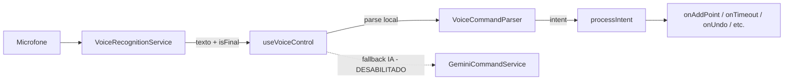
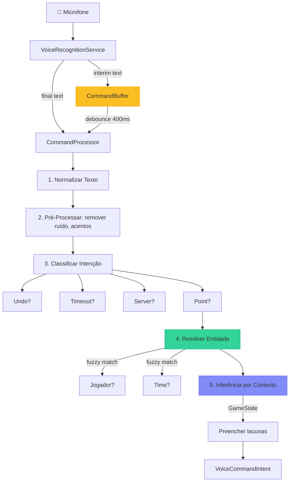

# PRD — Otimização Inteligente do Controle por Voz (Local Only)

> **Lote 12 • VolleyScore Pro v2**
> Escopo: Tornar o reconhecimento de voz funcional, responsivo e tolerante a nuances — **sem dependência de IA/LLM**.

---

## 1. Diagnóstico Atual

### 1.1 Arquitetura Existente



| Arquivo | Linhas | Responsabilidade |
|---------|--------|-----------------|
| [VoiceRecognitionService.ts](file:///c:/Dev/VolleyScore-Pro/src/features/voice/services/VoiceRecognitionService.ts) | 192 | Web Speech API + Capacitor Speech |
| [VoiceCommandParser.ts](file:///c:/Dev/VolleyScore-Pro/src/features/voice/services/VoiceCommandParser.ts) | 331 | Parse local por keywords/vocabulário |
| [useVoiceControl.ts](file:///c:/Dev/VolleyScore-Pro/src/features/voice/hooks/useVoiceControl.ts) | 106 | Hook orquestrador |
| [GeminiCommandService.ts](file:///c:/Dev/VolleyScore-Pro/src/features/voice/services/GeminiCommandService.ts) | 188 | IA (desabilitada, `ENABLE_AI_VOICE_COMMANDS: false`) |
| [TTSService.ts](file:///c:/Dev/VolleyScore-Pro/src/features/voice/services/TTSService.ts) | 99 | Text-to-Speech para anúncios |

### 1.2 Por Que Falha Hoje

| # | Problema | Causa Raiz | Exemplo |
|---|---------|------------|---------|
| 1 | **Match exato de keywords** | `text.includes(keyword)` exige substring exata | "pont" (cortado) não casa com "ponto" |
| 2 | **Fuzzy match importado mas NÃO usado** | `isFuzzyMatch` está em `stringUtils.ts` mas nunca é chamado pelo parser | Erros de pronúncia/transcrição são ignorados |
| 3 | **Sem buffer temporal** | Resultados `interim` tentam parse imediato e falham | "Ponto do..." é parseado antes de terminar |
| 4 | **Sem inferência por contexto** | O parser não usa `GameState` (score, último set, etc.) | "Ace!" sem time → `unknown` (deveria inferir serving team) |
| 5 | **Colisão de vocabulário** | "saque" aparece tanto em `ace` quanto em `server` | Comando ambíguo sem priorização contextual |
|6 | **Nomes de jogadores sem fuzzy** | Match por `includes`/`startsWith` — sem tolerância a erros de transcrição | "Joao" não casa com "João" |
| 7 | **Sem feedback de frase parcial** | Resultados `interim` são descartados se não matcham | Usuário não sabe se o sistema ouviu algo |
| 8 | **Zero testes unitários** | Nenhum arquivo `*.test.ts` na feature `voice/` | Regressões invisíveis |

---

## 2. Nova Arquitetura de Voz (Local Only)

### 2.1 Pipeline de Processamento



### 2.2 Componentes da Nova Arquitetura

#### A. CommandBuffer (NOVO)
- Acumula resultados `interim` por **400ms** antes de processar
- Se um resultado `final` chegar, processa imediatamente e cancela o timer
- Evita parse prematuro de frases incompletas ("Ponto do...")

#### B. Normalização Avançada (MELHORIA no `normalizeText`)
- Remover acentos (á→a, ç→c, ñ→n) para tolerância a transcrição
- Normalizar números escritos por extenso ("vinte e cinco" → "25")
- Colapsar sinônimos fonéticos ("pont" → "ponto", "bloco" → "bloqueio")

#### C. Fuzzy Entity Resolution (MELHORIA no `resolveEntity`)
- Integrar `isFuzzyMatch` (Levenshtein) para nomes de jogadores e times
- Threshold dinâmico: 30% do comprimento do nome
- Prioridade: Exact > Jersey Number > Fuzzy Name > Team Generic

#### D. Context-Aware Inference (NOVO — `ContextResolver`)
- Recebe `servingTeam`, `lastScorerTeam`, `scoreA/B`, `isMatchOver`
- Regras de inferência:

| Frase | Contexto | Inferência |
|-------|----------|-----------|
| "Ace!" | `servingTeam = 'A'` | Point para Team A, skill: ace |
| "Ponto!" (sem time) | `lastScorerTeam = 'A'` | Point para Team A (continuidade) |
| "Erro!" | `servingTeam = 'A'` | Point para Team B (erro do receptor) |
| "Bloqueio!" | `lastScorerTeam = null` | `requiresMoreInfo = true` |
| "Saque" (contexto ambíguo) | Analisar se veio com "ponto" | Diferenciar ace vs troca de saque |

#### E. Vocabulário Expandido com Sinônimos Fonéticos (MELHORIA)
Adicionar variantes comuns de transcrição incorreta da Web Speech API:

```
"pont" → ponto | "pontu" → ponto | "bloco" → bloqueio
"taime" → time | "taimaute" → timeout | "cortô" → cortada
```

---

## 3. Estratégia de Contexto com `GameState`

### 3.1 Dados Disponíveis no Contexto Atual

O hook `useVoiceControl` já recebe:
- `servingTeam: TeamId | null`
- `teamAName / teamBName`
- `playersA / playersB`
- `language`
- `enablePlayerStats`

### 3.2 Dados Adicionais Necessários

Para inferência avançada, o `VoiceCommandParser.parse()` precisa receber:

```typescript
interface VoiceContext {
  // Já existentes
  teamAName: string;
  teamBName: string;
  playersA: Player[];
  playersB: Player[];
  statsEnabled: boolean;
  servingTeam: TeamId | null;
  
  // NOVOS — para inferência contextual
  lastScorerTeam: TeamId | null;   // Continuidade de pontuação
  scoreA: number;                   // Para contexto "match point"
  scoreB: number;
  currentSet: number;
  isMatchOver: boolean;             // Bloquear comandos pós-jogo
}
```

### 3.3 Regras de Inferência Contextual

```
REGRA 1: "Ace/Saque Ponto" sem time → servingTeam
REGRA 2: "Ponto/Mais Um" sem time → lastScorerTeam (continuidade)
REGRA 3: "Erro" sem time → time OPOSTO ao servingTeam
REGRA 4: "Bloqueio" sem time → time OPOSTO ao servingTeam (bloqueio defende)
REGRA 5: Comando qualquer + isMatchOver → rejeitar com feedback
REGRA 6: "Saque" SEM "ponto/ace" → troca de server (não é ace)
REGRA 7: "Saque" COM "ponto/ace/direto" → skill ace
```

---

## 4. Mapeamento de Comandos Essenciais (100% Funcional)

### Tier 1 — Críticos (devem funcionar SEMPRE)

| Comando | Variantes PT | Variantes EN | Ação |
|---------|-------------|-------------|------|
| Ponto | ponto, marcou, mais um, vai, pont | point, score, plus one | `POINT` |
| Ponto + Time | ponto do/para [time], [time] marcou | point for [team] | `POINT + team` |
| Desfazer | desfazer, voltar, undo, ops, engano | undo, back, oops | `UNDO` |
| Corrigir | tirar ponto, menos, não foi, cancela | remove, minus, correction | `SUBTRACT_POINT` |

### Tier 2 — Importantes

| Comando | Variantes PT | Variantes EN | Ação |
|---------|-------------|-------------|------|
| Timeout | tempo, pausa, pedido de tempo | timeout, break | `TIMEOUT + team` |
| Troca Saque | saque [time], rodar, girar | serve [team], rotate | `SET_SERVER` |

### Tier 3 — Estatísticas (quando `statsEnabled`)

| Comando | Variantes PT | Variantes EN | Skill |
|---------|-------------|-------------|-------|
| Ataque | cortada, ataque, cravou, bomba | kill, spike, attack | `attack` |
| Bloqueio | bloqueio, paredão, toco, fechou | block, roof, stuff | `block` |
| Ace | ace, ponto de saque, direto | ace, service ace | `ace` |
| Erro | erro, fora, rede, invasão | error, fault, out | `opponent_error` |

---

## 5. Plano de Implementação

### Passo 1: Expandir Interface `VoiceContext`
- **Arquivo:** [domain.ts](file:///c:/Dev/VolleyScore-Pro/src/@types/domain.ts)
- Adicionar `lastScorerTeam`, `scoreA`, `scoreB`, `currentSet`, `isMatchOver` ao contexto

### Passo 2: Criar `CommandBuffer`
- **Arquivo:** [NOVO] `src/features/voice/services/CommandBuffer.ts`
- Debounce de 400ms para resultados interim
- Resultado `final` cancela debounce e processa imediatamente

### Passo 3: Refatorar `VoiceCommandParser`
- **Arquivo:** [VoiceCommandParser.ts](file:///c:/Dev/VolleyScore-Pro/src/features/voice/services/VoiceCommandParser.ts)
- **3a.** Melhorar `normalizeText`: remover acentos, normalizar números
- **3b.** Integrar `isFuzzyMatch` no `resolveEntity` para nomes de jogadores
- **3c.** Criar método `resolveByContext()` com as 7 regras de inferência
- **3d.** Resolver colisão "saque" (ace vs server) com análise de co-ocorrência
- **3e.** Adicionar sinônimos fonéticos ao VOCABULARY

### Passo 4: Atualizar `useVoiceControl`
- **Arquivo:** [useVoiceControl.ts](file:///c:/Dev/VolleyScore-Pro/src/features/voice/hooks/useVoiceControl.ts)
- Usar `CommandBuffer` ao invés de processar diretamente
- Passar dados adicionais do `GameState` para o parser
- Melhorar feedback via `VoiceToast` para frases parciais

### Passo 5: Testes Unitários
- **Arquivo:** [NOVO] `src/features/voice/services/__tests__/VoiceCommandParser.test.ts`
- Testar cada regra de inferência
- Testar fuzzy matching de nomes
- Testar normalização com acentos e números
- Testar colisão de vocabulário (saque como ace vs server)

---

## 6. Verificação

### Testes Automatizados
```bash
npx vitest run src/features/voice/services/__tests__/VoiceCommandParser.test.ts
```

### Teste Manual
1. Rodar `npm run dev` no browser
2. Ativar voz e falar frases naturais como:
   - "Ponto!" (deve inferir time pelo contexto)
   - "Ace!" (deve inferir time que está sacando)
   - "Ponto do João" (deve fazer fuzzy match com "João")
   - "Pont da casa" (deve tolerar "pont" truncado)
3. Verificar que o `VoiceToast` mostra feedback adequado para cada comando

---

## 7. Fora de Escopo

- ❌ Integração com Gemini/IA — permanece desabilitada (`ENABLE_AI_VOICE_COMMANDS: false`)
- ❌ Mudanças no `VoiceRecognitionService` — o engine de reconhecimento está funcional
- ❌ Mudanças no `TTSService` — o Text-to-Speech está separado e funcional
- ❌ Mudanças no `GeminiCommandService` — mantido como está para uso futuro
