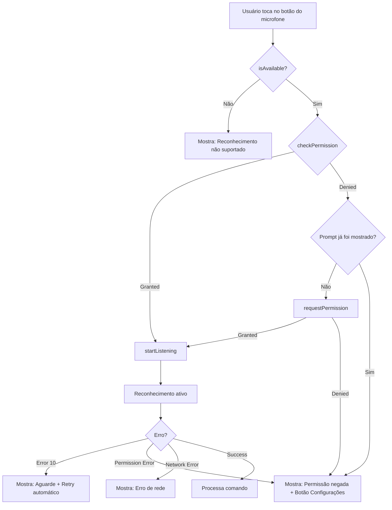

# PRD: Correção Definitiva do Reconhecimento de Voz no Android
**Lote 13 — Native Voice Recognition Audit & Fix**

---

## 1. Diagnóstico da Causa Raiz

### 1.1 Arquitetura Atual

O projeto utiliza uma **arquitetura híbrida customizada** para reconhecimento de voz:

```
┌─────────────────────────────────────────────────────────────────┐
│                    VoiceRecognitionService                       │
│                    (Singleton - TypeScript)                      │
└───────────────────────────┬─────────────────────────────────────┘
                            │
                            ▼
┌─────────────────────────────────────────────────────────────────┐
│                      EngineSelector                              │
│              Sempre retorna: NativeEngine                        │
└───────────────────────────┬─────────────────────────────────────┘
                            │
                            ▼
┌─────────────────────────────────────────────────────────────────┐
│                       NativeEngine                               │
│         Detecta plataforma e seleciona implementação            │
├─────────────────────────────────────────────────────────────────┤
│  isNative === true   │  VoiceRecognition Plugin (Custom Java)   │
│  isNative === false  │  Web Speech API (SpeechRecognition)      │
└─────────────────────────────────────────────────────────────────┘
```

### 1.2 Análise Detalhada dos Componentes

#### A. Plugin Nativo Customizado ([`VoiceRecognitionPlugin.java`](android/app/src/main/java/com/volleyscore/pro2/VoiceRecognitionPlugin.java))

**Status: ✅ Implementado Corretamente**

O projeto **NÃO utiliza** `@capacitor-community/speech-recognition`. Em vez disso, possui um plugin nativo customizado que:

- Usa `android.speech.SpeechRecognizer` (API nativa Android)
- Implementa modo contínuo com auto-restart
- Possui tratamento robusto para Error 10 (rate limiting)
- Gerencia lifecycle (pause/resume/destroy)
- Solicita permissão de microfone via Capacitor Permission API

#### B. Permissões no AndroidManifest.xml

**Status: ✅ Declarado Corretamente**

```xml
<!-- Linha 47 -->
<uses-permission android:name="android.permission.RECORD_AUDIO" />
```

A permissão `RECORD_AUDIO` está declarada. O projeto também inclui:
- `<queries>` para `RecognizerIntent` (necessário para Android 11+)
- Permissões de câmera, internet, vibração, etc.

#### C. Solicitação de Permissão em Runtime

**Status: ⚠️ Parcialmente Implementado**

A permissão é solicitada em **dois lugares**:

1. **[`MainActivity.java`](android/app/src/main/java/com/volleyscore/pro2/MainActivity.java:66-77)** - Na inicialização do app:
```java
if (Build.VERSION.SDK_INT >= Build.VERSION_CODES.M) {
    String[] permissions = {
        "android.permission.CAMERA",
        "android.permission.RECORD_AUDIO"
    };
    // ... requestPermissions()
}
```

2. **[`VoiceRecognitionPlugin.java`](android/app/src/main/java/com/volleyscore/pro2/VoiceRecognitionPlugin.java:88-96)** - Ao iniciar o reconhecimento:
```java
if (getPermissionState("microphone") != PermissionState.GRANTED) {
    requestPermissionForAlias("microphone", call, "microphonePermissionCallback");
    return;
}
```

#### D. Detecção de Plataforma no TypeScript

**Status: ✅ Implementado Corretamente**

[`NativeEngine.ts`](src/features/voice/engines/NativeEngine.ts:44-46):
```typescript
constructor() {
    this.isNative = Capacitor.isNativePlatform();
}
```

---

### 1.3 Problemas Identificados

#### 🔴 CRÍTICO: Falta de Pre-Flight Permission Check

**Arquivo:** [`useVoiceControl.ts`](src/features/voice/hooks/useVoiceControl.ts:439-444)

```typescript
const startListening = useCallback(() => {
    if (!isListeningRef.current) {
        deduplicatorRef.current.reset();
        recognitionService.start(language); // ❌ Sem verificar permissão antes
    }
}, [language, recognitionService]);
```

**Problema:** O código TypeScript não verifica se a permissão foi concedida **antes** de tentar iniciar o reconhecimento. A verificação acontece apenas no lado nativo (Java), o que pode causar:

- Falha silenciosa se o usuário negou a permissão
- Falta de feedback visual adequado
- Dificuldade em guiar o usuário às configurações

#### 🟡 MÉDIO: Web Speech API Fallback em WebView

**Arquivo:** [`NativeEngine.ts`](src/features/voice/engines/NativeEngine.ts:170-244)

O fallback para Web Speech API (`window.SpeechRecognition`) **não funciona em Android WebView**:

```typescript
private async startWeb(locale: string) {
    const SpeechRecognitionAPI =
        (globalThis as any).SpeechRecognition ||
        (globalThis as any).webkitSpeechRecognition;
    // ❌ WebView não suporta Web Speech API
}
```

**Impacto:** Se `Capacitor.isNativePlatform()` retornar `false` incorretamente, o reconhecimento falhará silenciosamente.

#### 🟡 MÉDIO: Tratamento de Erro 10 (Rate Limiting)

**Arquivo:** [`VoiceRecognitionPlugin.java`](android/app/src/main/java/com/volleyscore/pro2/VoiceRecognitionPlugin.java:361-383)

O Error 10 (`ERROR_TOO_MANY_REQUESTS`) indica que o Google Voice Service está bloqueando requisições. O plugin tem tratamento, mas:

- O delay de 3.5s pode não ser suficiente
- Não há feedback visual para o usuário durante o bloqueio
- Após 3 erros consecutivos, o plugin desiste completamente

#### 🟢 BAIXO: Ausência de Verificação de Disponibilidade

**Arquivo:** [`VoiceRecognitionService.ts`](src/features/voice/services/VoiceRecognitionService.ts:84-102)

O método `isAvailable()` existe mas **não é chamado** antes de iniciar o reconhecimento:

```typescript
public async isAvailable(): Promise<boolean> {
    // Verifica disponibilidade mas nunca é usado antes de start()
}
```

---

### 1.4 Resumo da Causa Raiz

| Problema | Severidade | Causa |
|----------|------------|-------|
| Falha silenciosa ao negar permissão | 🔴 CRÍTICO | Sem pre-flight check no TypeScript |
| WebView não suporta Web Speech API | 🟡 MÉDIO | Fallback inadequado para WebView |
| Rate limiting sem feedback | 🟡 MÉDIO | Error 10 tratado mas não comunicado |
| Disponibilidade não verificada | 🟢 BAIXO | `isAvailable()` não utilizado |

---

## 2. Plano de Arquitetura Nativa

### 2.1 Decisão: Manter Plugin Customizado

**NÃO é necessário instalar `@capacitor-community/speech-recognition`.**

O plugin customizado [`VoiceRecognitionPlugin.java`](android/app/src/main/java/com/volleyscore/pro2/VoiceRecognitionPlugin.java) é **mais robusto** que o plugin da comunidade porque:

1. Implementa modo contínuo com auto-restart
2. Tem tratamento específico para Error 10
3. Gerencia lifecycle do Android corretamente
4. Não mostra popup do Google (background recognition)

### 2.2 Arquitetura Proposta

```
┌─────────────────────────────────────────────────────────────────┐
│                    useVoiceControl (Hook)                        │
├─────────────────────────────────────────────────────────────────┤
│  1. checkPermission() → Verifica permissão antes de iniciar     │
│  2. requestPermission() → Solicita se não tiver                 │
│  3. isAvailable() → Verifica se reconhecimento é suportado      │
│  4. startListening() → Inicia apenas se tudo OK                 │
└───────────────────────────┬─────────────────────────────────────┘
                            │
                            ▼
┌─────────────────────────────────────────────────────────────────┐
│                 VoiceRecognitionService                          │
├─────────────────────────────────────────────────────────────────┤
│  NOVOS MÉTODOS:                                                  │
│  + checkPermission(): Promise<PermissionStatus>                 │
│  + requestPermission(): Promise<boolean>                        │
│  + isAvailable(): Promise<boolean> (já existe, usar)            │
└───────────────────────────┬─────────────────────────────────────┘
                            │
                            ▼
┌─────────────────────────────────────────────────────────────────┐
│                      NativeEngine                                │
├─────────────────────────────────────────────────────────────────┤
│  NOVOS MÉTODOS:                                                  │
│  + checkPermission(): Promise<PermissionStatus>                 │
│  + requestPermission(): Promise<boolean>                        │
│                                                                  │
│  NATIVE: Usa VoiceRecognition plugin methods                     │
│  WEB: Usa navigator.permissions.query({name: 'microphone'})     │
└───────────────────────────┬─────────────────────────────────────┘
                            │
                            ▼
┌─────────────────────────────────────────────────────────────────┐
│               VoiceRecognitionPlugin (Java)                      │
├─────────────────────────────────────────────────────────────────┤
│  NOVOS MÉTODOS:                                                  │
│  + checkPermission(): Promise<{granted: boolean}>               │
│  + requestPermission(): Promise<{granted: boolean}>             │
│                                                                  │
│  Ambos já existem implicitamente via Capacitor Permission API   │
└─────────────────────────────────────────────────────────────────┘
```

### 2.3 Fluxo de Solicitação de Permissão



### 2.4 Fallback Elegante (Web vs Native)

```typescript
// NativeEngine.ts - Proposta de implementação

async checkPermission(): Promise<'granted' | 'denied' | 'prompt'> {
    if (this.isNative) {
        // Usa Capacitor Permissions API
        const status = await VoiceRecognition.checkPermission();
        return status.granted ? 'granted' : 'denied';
    } else {
        // Web: usa Permissions API
        if ('permissions' in navigator) {
            const result = await navigator.permissions.query({ name: 'microphone' as any });
            return result.state; // 'granted' | 'denied' | 'prompt'
        }
        return 'prompt'; // Fallback para browsers sem Permissions API
    }
}

async requestPermission(): Promise<boolean> {
    if (this.isNative) {
        try {
            const result = await VoiceRecognition.requestPermission();
            return result.granted;
        } catch {
            return false;
        }
    } else {
        // Web: a permissão é solicitada automaticamente ao iniciar
        return true;
    }
}
```

### 2.5 Mudanças Necessárias

#### A. VoiceRecognitionPlugin.java - Adicionar Métodos Explícitos

```java
@PluginMethod
public void checkPermission(PluginCall call) {
    JSObject result = new JSObject();
    result.put("granted", getPermissionState("microphone") == PermissionState.GRANTED);
    call.resolve(result);
}

@PluginMethod
public void requestPermission(PluginCall call) {
    if (getPermissionState("microphone") == PermissionState.GRANTED) {
        JSObject result = new JSObject();
        result.put("granted", true);
        call.resolve(result);
    } else {
        requestPermissionForAlias("microphone", call, "permissionResultCallback");
    }
}

@PermissionCallback
private void permissionResultCallback(PluginCall call) {
    JSObject result = new JSObject();
    result.put("granted", getPermissionState("microphone") == PermissionState.GRANTED);
    call.resolve(result);
}
```

#### B. NativeEngine.ts - Adicionar Métodos de Permissão

```typescript
// Adicionar à interface SpeechEngine
checkPermission(): Promise<'granted' | 'denied' | 'prompt'>;
requestPermission(): Promise<boolean>;

// Implementar em NativeEngine
async checkPermission(): Promise<'granted' | 'denied' | 'prompt'> {
    if (this.isNative) {
        const result = await VoiceRecognition.checkPermission();
        return result.granted ? 'granted' : 'denied';
    }
    // Web fallback...
}

async requestPermission(): Promise<boolean> {
    if (this.isNative) {
        const result = await VoiceRecognition.requestPermission();
        return result.granted;
    }
    // Web fallback...
}
```

#### C. VoiceRecognitionService.ts - Expor Métodos de Permissão

```typescript
public async checkPermission(): Promise<'granted' | 'denied' | 'prompt'> {
    return this.engine.checkPermission();
}

public async requestPermission(): Promise<boolean> {
    return this.engine.requestPermission();
}
```

#### D. useVoiceControl.ts - Pre-Flight Check

```typescript
const startListening = useCallback(async () => {
    if (isListeningRef.current) return;
    
    // 1. Verificar disponibilidade
    const available = await recognitionService.isAvailable();
    if (!available) {
        showNotification({ type: 'error', mainText: 'Reconhecimento não disponível' });
        return;
    }
    
    // 2. Verificar permissão
    const permission = await recognitionService.checkPermission();
    
    if (permission === 'denied') {
        // Permissão negada permanentemente - guiar para configurações
        showNotification({ 
            type: 'error', 
            mainText: 'Permissão de microfone negada',
            action: { label: 'Configurações', onClick: openAppSettings }
        });
        return;
    }
    
    if (permission === 'prompt') {
        // Solicitar permissão
        const granted = await recognitionService.requestPermission();
        if (!granted) {
            showNotification({ type: 'error', mainText: 'Permissão negada' });
            return;
        }
    }
    
    // 3. Iniciar reconhecimento
    deduplicatorRef.current.reset();
    recognitionService.start(language);
}, [language, recognitionService, showNotification]);
```

---

## 3. Checklist de Implementação

### Fase 1: Plugin Nativo (Java)
- [ ] Adicionar método `checkPermission()` em `VoiceRecognitionPlugin.java`
- [ ] Adicionar método `requestPermission()` em `VoiceRecognitionPlugin.java`
- [ ] Adicionar callback `permissionResultCallback()` em `VoiceRecognitionPlugin.java`

### Fase 2: Engine TypeScript
- [ ] Atualizar interface `SpeechEngine` com novos métodos
- [ ] Implementar `checkPermission()` em `NativeEngine.ts`
- [ ] Implementar `requestPermission()` em `NativeEngine.ts`
- [ ] Adicionar fallback Web para permissões

### Fase 3: Service Layer
- [ ] Expor `checkPermission()` em `VoiceRecognitionService.ts`
- [ ] Expor `requestPermission()` em `VoiceRecognitionService.ts`

### Fase 4: UI/Hook Layer
- [ ] Implementar pre-flight check em `useVoiceControl.ts`
- [ ] Adicionar feedback visual para cada estado de permissão
- [ ] Implementar botão "Abrir Configurações" para permissão negada permanentemente
- [ ] Adicionar tratamento visual para Error 10 (rate limiting)

### Fase 5: Testes
- [ ] Testar fluxo de permissão em dispositivo real Android
- [ ] Testar cenário de permissão negada
- [ ] Testar cenário de permissão negada permanentemente
- [ ] Testar Error 10 e recovery
- [ ] Testar Web/PWA fallback

---

## 4. Riscos e Mitigações

| Risco | Probabilidade | Mitigação |
|-------|---------------|-----------|
| Google Voice Service indisponível | Média | Mostrar mensagem clara + fallback manual |
| Error 10 persistente | Média | Delay progressivo + feedback visual |
| WebView sem Web Speech API | Baixa | Já detectado via `isNativePlatform()` |
| Permissão negada permanentemente | Alta | Botão para abrir configurações do app |

---

## 5. Dependências

**Nenhuma nova dependência necessária.**

O projeto já possui:
- ✅ `@capacitor/core` (registerPlugin, PermissionState)
- ✅ Plugin nativo customizado implementado
- ✅ Permissão `RECORD_AUDIO` declarada no AndroidManifest

---

## 6. Referências

- [Android SpeechRecognizer Docs](https://developer.android.com/reference/android/speech/SpeechRecognizer)
- [Capacitor Plugin Development](https://capacitorjs.com/docs/plugins)
- [Android Runtime Permissions](https://developer.android.com/guide/topics/permissions/overview)
- [Web Speech API Browser Support](https://caniuse.com/speech-recognition)

---

**Documento gerado em:** 2026-02-24  
**Autor:** Lead Mobile Architect (Kilo Code)  
**Status:** Aguardando Aprovação para Implementação
