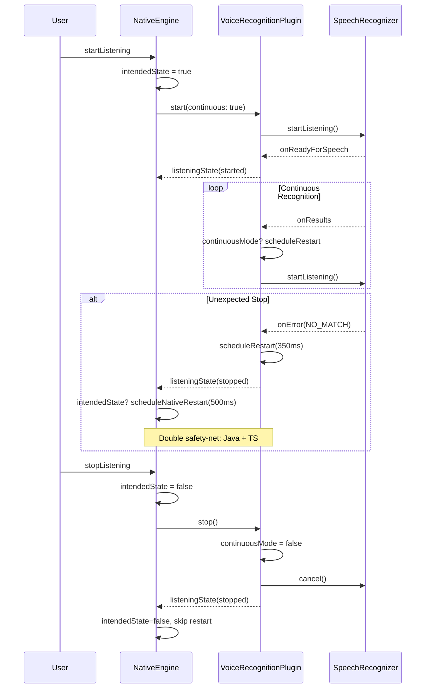

# SPEC: Correção Definitiva do Reconhecimento de Voz no Android
**Lote 13 — Implementation Specification**

---

## Status da Implementação Atual

### ✅ JÁ IMPLEMENTADO no Plugin Java

| Feature | Arquivo | Linhas |
|---------|---------|--------|
| `continuousMode` boolean | `VoiceRecognitionPlugin.java` | 58, 174 |
| `scheduleRestart()` com Handler | `VoiceRecognitionPlugin.java` | 241-262 |
| Auto-restart em `onResults()` | `VoiceRecognitionPlugin.java` | 418-421 |
| Auto-restart em `onError()` (recoverable) | `VoiceRecognitionPlugin.java` | 385-389 |
| `handleOnPause()` lifecycle | `VoiceRecognitionPlugin.java` | 133-145 |
| `handleOnResume()` lifecycle | `VoiceRecognitionPlugin.java` | 147-157 |
| Rate limiting com `RATE_LIMITED` | `VoiceRecognitionPlugin.java` | 181 |
| `consecutiveError10Count` protection | `VoiceRecognitionPlugin.java` | 53, 361-383 |

### ✅ JÁ IMPLEMENTADO no NativeEngine.ts

| Feature | Arquivo | Linhas |
|---------|---------|--------|
| `continuous: true` no start | `NativeEngine.ts` | 105 |
| `removeAllListeners()` cleanup | `NativeEngine.ts` | 138 |
| `scheduleNativeRestart()` safety-net | `NativeEngine.ts` | 123-131 |
| Debounce de 1000ms | `NativeEngine.ts` | 43-48 |

### ✅ JÁ IMPLEMENTADO no VoiceRecognitionService.ts

| Feature | Arquivo | Linhas |
|---------|---------|--------|
| `isAvailable()` com platform check | `VoiceRecognitionService.ts` | 84-102 |

---

## GAPS IDENTIFICADOS

### GAP 1: Auto-restart no `listeningState` listener (NativeEngine.ts)

**Problema:** Quando o Java envia `status: 'stopped'` inesperadamente, o TypeScript não tenta reiniciar.

**Localização:** `NativeEngine.ts` linhas 78-80

```typescript
// CÓDIGO ATUAL (linha 78-80)
const stateListener = await VoiceRecognition.addListener('listeningState', (data) => {
    this.updateStatus(data.status === 'started');
});
```

### GAP 2: Falta de controle de `intendedState` no NativeEngine

**Problema:** O engine não sabe se o usuário queria estar ouvindo (para decidir se deve reiniciar).

---

## BLOCOS DE SEARCH & REPLACE

### 1. NativeEngine.ts — Adicionar `intendedState` e auto-restart no listener

#### 1.1 Adicionar propriedade `intendedState`

**SEARCH:**
```typescript
    private isListening: boolean = false;
    private isStarting: boolean = false;
    private listeners: PluginListenerHandle[] = [];
    private webRecognition: any = null;
```

**REPLACE:**
```typescript
    private isListening: boolean = false;
    private isStarting: boolean = false;
    private listeners: PluginListenerHandle[] = [];
    private webRecognition: any = null;
    private intendedState: boolean = false; // User wants to be listening
    private lastLocale: string = 'pt-BR'; // For auto-restart
```

---

#### 1.2 Atualizar `start()` para definir `intendedState`

**SEARCH:**
```typescript
    async start(language: string): Promise<void> {
        if (this.isStarting) {
            console.warn('[NativeEngine] start() already in progress, ignoring');
            return;
        }

        const now = Date.now();
        if (now - this.lastJsStartCalledMs < 1000) {
            console.warn('[NativeEngine] Start requested too quickly. Debouncing.');
            return;
        }
        this.lastJsStartCalledMs = now;

        const langMap: Record<string, string> = { pt: 'pt-BR', en: 'en-US', es: 'es-ES' };
        const locale = langMap[language] || 'en-US';

        if (this.isNative) {
            await this.startNative(locale);
        } else {
            await this.startWeb(locale);
        }
    }
```

**REPLACE:**
```typescript
    async start(language: string): Promise<void> {
        if (this.isStarting) {
            console.warn('[NativeEngine] start() already in progress, ignoring');
            return;
        }

        const now = Date.now();
        if (now - this.lastJsStartCalledMs < 1000) {
            console.warn('[NativeEngine] Start requested too quickly. Debouncing.');
            return;
        }
        this.lastJsStartCalledMs = now;

        const langMap: Record<string, string> = { pt: 'pt-BR', en: 'en-US', es: 'es-ES' };
        const locale = langMap[language] || 'en-US';
        
        this.intendedState = true;
        this.lastLocale = locale;

        if (this.isNative) {
            await this.startNative(locale);
        } else {
            await this.startWeb(locale);
        }
    }
```

---

#### 1.3 Atualizar `stop()` para limpar `intendedState`

**SEARCH:**
```typescript
    async stop(): Promise<void> {
        if (this.restartTimeout) {
            clearTimeout(this.restartTimeout);
            this.restartTimeout = null;
        }
        if (this.isNative) {
            await VoiceRecognition.stop().catch((e: any) => console.warn('[NativeEngine] stop error:', e));
            await this.removeNativeListeners();
        } else if (this.webRecognition) {
            try { this.webRecognition.stop(); } catch (e) { }
            this.webRecognition = null;
        }
        this.updateStatus(false);
    }
```

**REPLACE:**
```typescript
    async stop(): Promise<void> {
        this.intendedState = false; // User wants to stop
        if (this.restartTimeout) {
            clearTimeout(this.restartTimeout);
            this.restartTimeout = null;
        }
        if (this.isNative) {
            await VoiceRecognition.stop().catch((e: any) => console.warn('[NativeEngine] stop error:', e));
            await this.removeNativeListeners();
        } else if (this.webRecognition) {
            try { this.webRecognition.stop(); } catch (e) { }
            this.webRecognition = null;
        }
        this.updateStatus(false);
    }
```

---

#### 1.4 Atualizar `listeningState` listener com auto-restart

**SEARCH:**
```typescript
            const stateListener = await VoiceRecognition.addListener('listeningState', (data) => {
                this.updateStatus(data.status === 'started');
            });
```

**REPLACE:**
```typescript
            const stateListener = await VoiceRecognition.addListener('listeningState', (data) => {
                const isStarted = data.status === 'started';
                this.updateStatus(isStarted);
                
                // AUTO-RESTART: Se parou inesperadamente e o usuário queria ouvir
                if (!isStarted && this.intendedState && !this.isStarting) {
                    console.log('[NativeEngine] Unexpected stop detected. Scheduling restart in 500ms...');
                    this.scheduleNativeRestart(this.lastLocale, 500);
                }
            });
```

---

#### 1.5 Atualizar `scheduleNativeRestart()` para respeitar `intendedState`

**SEARCH:**
```typescript
    private scheduleNativeRestart(locale: string, delayMs: number = 2000): void {
        if (this.restartTimeout !== null) clearTimeout(this.restartTimeout);
        this.restartTimeout = setTimeout(async () => {
            this.restartTimeout = null;
            console.log('[NativeEngine] TS safety-net restart firing...');
            await this.removeNativeListeners();
            await this.startNative(locale);
        }, delayMs);
    }
```

**REPLACE:**
```typescript
    private scheduleNativeRestart(locale: string, delayMs: number = 2000): void {
        if (this.restartTimeout !== null) clearTimeout(this.restartTimeout);
        this.restartTimeout = setTimeout(async () => {
            this.restartTimeout = null;
            
            // Só reinicia se o usuário ainda quiser ouvir
            if (!this.intendedState) {
                console.log('[NativeEngine] Restart cancelled - user stopped listening');
                return;
            }
            
            console.log('[NativeEngine] TS safety-net restart firing...');
            await this.removeNativeListeners();
            await this.startNative(locale);
        }, delayMs);
    }
```

---

### 2. VoiceRecognitionPlugin.java — Melhorias no Rate Limiting

#### 2.1 Melhorar mensagem de erro no `onError`

**SEARCH:**
```java
                // Se der erro 10 mais de 3 vezes, DESISTIR. O Google travou.
                    if (consecutiveError10Count > 3) {
                         Log.e(TAG, "FATAL: Too many consecutive Error 10s. Giving up auto-restart.");
                         continuousMode = false; // Desliga o modo contínuo
                         isRecoverable = false;
                         errorMsg = "Google Voice Engine is locked. Please try again later.";
                    }
```

**REPLACE:**
```java
                // Se der erro 10 mais de 3 vezes, DESISTIR. O Google travou.
                    if (consecutiveError10Count > 3) {
                         Log.e(TAG, "FATAL: Too many consecutive Error 10s. Giving up auto-restart.");
                         continuousMode = false; // Desliga o modo contínuo
                         isRecoverable = false;
                         errorMsg = "RATE_LIMITED"; // Sentinel string for TS to handle
                    }
```

---

#### 2.2 Adicionar log detalhado no `onReadyForSpeech`

**SEARCH:**
```java
            @Override
            public void onReadyForSpeech(Bundle params) {
                consecutiveError10Count = 0;
                Log.d(TAG, "onReadyForSpeech — microphone is active");
                isListening = true;
                JSObject ret = new JSObject();
                ret.put("status", "started");
                notifyListeners("listeningState", ret);
            }
```

**REPLACE:**
```java
            @Override
            public void onReadyForSpeech(Bundle params) {
                consecutiveError10Count = 0;
                Log.i(TAG, "onReadyForSpeech — microphone is active, continuousMode=" + continuousMode);
                isListening = true;
                JSObject ret = new JSObject();
                ret.put("status", "started");
                notifyListeners("listeningState", ret);
            }
```

---

### 3. VoiceRecognitionService.ts — Melhorar `isAvailable()`

**O código atual já está correto**, mas podemos adicionar um log:

**SEARCH:**
```typescript
  public async isAvailable(): Promise<boolean> {
    if (Capacitor.isNativePlatform()) {
      // Consulta o plugin nativo — SpeechRecognizer.isRecognitionAvailable()
      try {
        const { registerPlugin } = await import('@capacitor/core');
        const VoiceRecognition = registerPlugin<{ available(): Promise<{ available: boolean }> }>('VoiceRecognition');
        const result = await VoiceRecognition.available();
        return result.available;
      } catch {
        // Se o plugin não estiver registrado (improvável) — assume disponível
        return true;
      }
    }
    // Web / PWA: verificar Web Speech API
    return !!(
      (globalThis as any).SpeechRecognition ||
      (globalThis as any).webkitSpeechRecognition
    );
  }
```

**REPLACE:**
```typescript
  public async isAvailable(): Promise<boolean> {
    if (Capacitor.isNativePlatform()) {
      // Consulta o plugin nativo — SpeechRecognizer.isRecognitionAvailable()
      try {
        const { registerPlugin } = await import('@capacitor/core');
        const VoiceRecognition = registerPlugin<{ available(): Promise<{ available: boolean }> }>('VoiceRecognition');
        const result = await VoiceRecognition.available();
        console.log('[VoiceRecognitionService] Native availability:', result.available);
        return result.available;
      } catch (e) {
        // Se o plugin não estiver registrado (improvável) — assume disponível
        console.warn('[VoiceRecognitionService] Native availability check failed:', e);
        return true;
      }
    }
    // Web / PWA: verificar Web Speech API
    const hasWebSpeech = !!(
      (globalThis as any).SpeechRecognition ||
      (globalThis as any).webkitSpeechRecognition
    );
    console.log('[VoiceRecognitionService] Web Speech API available:', hasWebSpeech);
    return hasWebSpeech;
  }
```

---

## Resumo das Mudanças

| Arquivo | Mudança | Impacto |
|---------|---------|---------|
| `NativeEngine.ts` | Adicionar `intendedState` e `lastLocale` | Controle de estado para auto-restart |
| `NativeEngine.ts` | Auto-restart no `listeningState` listener | Recuperação automática de paradas inesperadas |
| `NativeEngine.ts` | `scheduleNativeRestart()` respeita `intendedState` | Evita restart quando usuário parou |
| `VoiceRecognitionPlugin.java` | Error message `RATE_LIMITED` | TS pode tratar rate limiting |
| `VoiceRecognitionService.ts` | Logs de disponibilidade | Debug facilitado |

---

## Fluxo de Auto-Restart (Após Mudanças)



---

## Checklist de Implementação

### Fase 1: NativeEngine.ts
- [ ] Adicionar propriedades `intendedState` e `lastLocale`
- [ ] Atualizar `start()` para definir `intendedState = true`
- [ ] Atualizar `stop()` para definir `intendedState = false`
- [ ] Atualizar `listeningState` listener com auto-restart
- [ ] Atualizar `scheduleNativeRestart()` para respeitar `intendedState`

### Fase 2: VoiceRecognitionPlugin.java
- [ ] Alterar mensagem de erro para `RATE_LIMITED`
- [ ] Adicionar log detalhado no `onReadyForSpeech`

### Fase 3: VoiceRecognitionService.ts
- [ ] Adicionar logs de debug no `isAvailable()`

### Fase 4: Testes
- [ ] Testar auto-restart após NO_MATCH
- [ ] Testar auto-restart após NO_SPEECH
- [ ] Testar parada correta quando usuário solicita stop
- [ ] Testar rate limiting (Error 10)
- [ ] Testar lifecycle (pause/resume)

---

**Documento gerado em:** 2026-02-24  
**Autor:** Lead Mobile Architect (Kilo Code)  
**Status:** Pronto para Implementação
